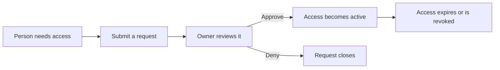
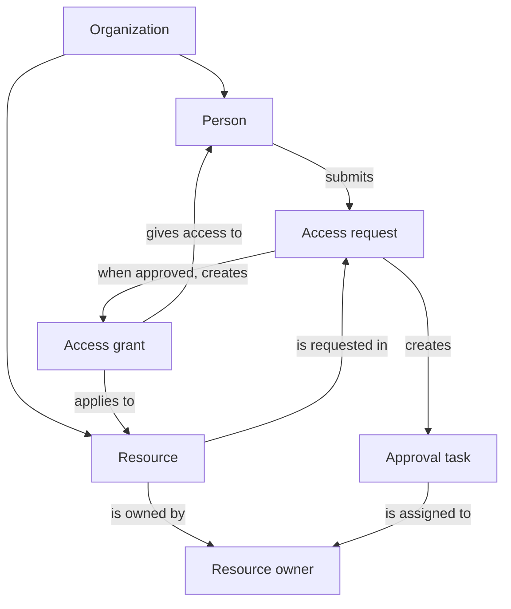
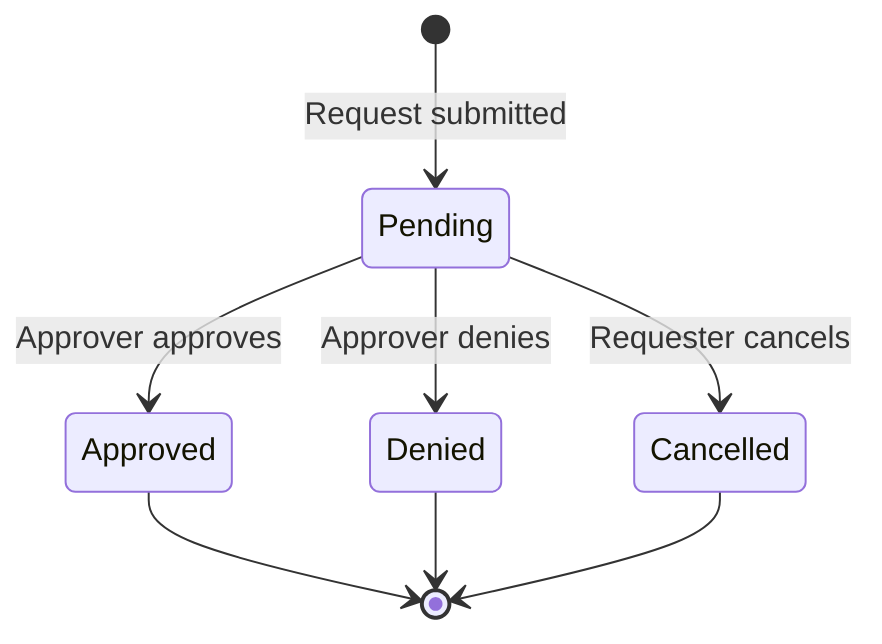
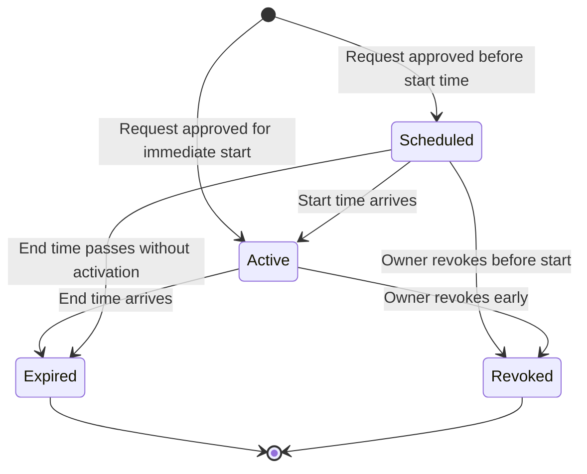
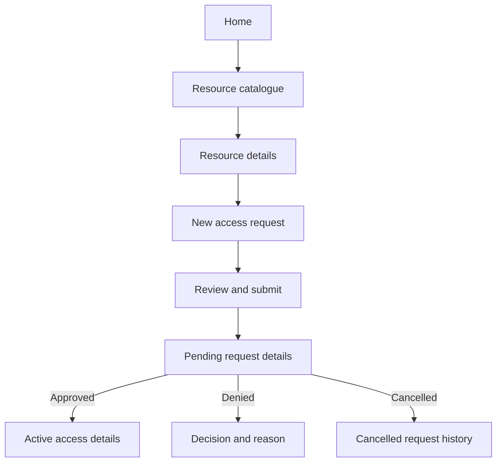
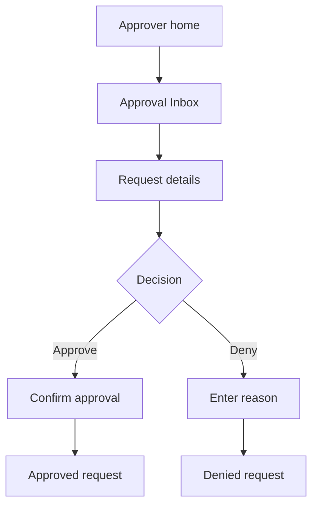
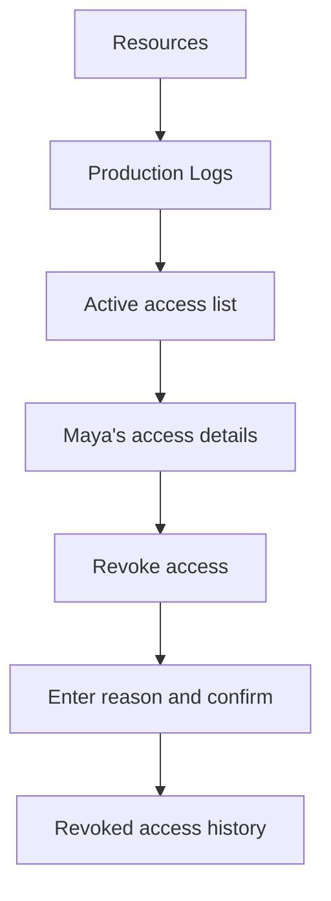
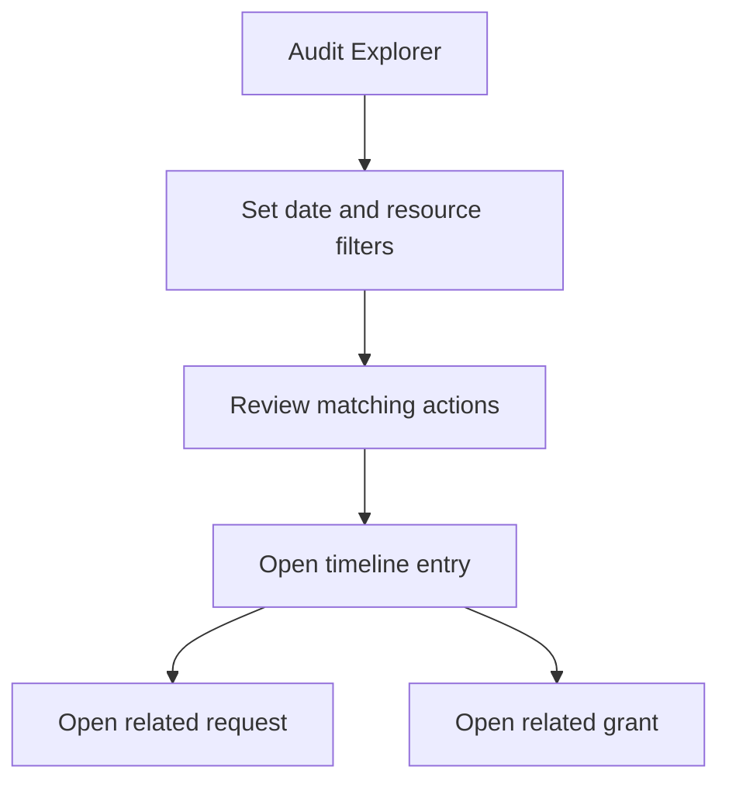

# Access Request and Approval System

## A beginner-friendly concept for a serious Spine TS demonstration

**Document status:** First detailed concept draft  
**Purpose:** Describe the demonstration domain, user scenarios, user interface, and the Spine capabilities the example should make visible.  
**Working title for the application:** Access Desk  
**Primary audience:** People evaluating the idea, designers, developers, and readers who are new to access-management software or event-driven applications.

---

## Table of contents

1. [Executive summary](#1-executive-summary)
2. [The problem in plain language](#2-the-problem-in-plain-language)
3. [What this demonstration is—and is not](#3-what-this-demonstration-isand-is-not)
4. [A short example](#4-a-short-example)
5. [People and roles](#5-people-and-roles)
6. [Things the system keeps track of](#6-things-the-system-keeps-track-of)
7. [How the domain fits together](#7-how-the-domain-fits-together)
8. [The request lifecycle](#8-the-request-lifecycle)
9. [The access-grant lifecycle](#9-the-access-grant-lifecycle)
10. [Business rules](#10-business-rules)
11. [Detailed user scenarios](#11-detailed-user-scenarios)
12. [Notifications and live updates](#12-notifications-and-live-updates)
13. [User-interface structure](#13-user-interface-structure)
14. [Screen-by-screen UI description](#14-screen-by-screen-ui-description)
15. [Complete UI flows](#15-complete-ui-flows)
16. [UI states and error handling](#16-ui-states-and-error-handling)
17. [Accessibility and usability](#17-accessibility-and-usability)
18. [How the demonstration uses Spine TS](#18-how-the-demonstration-uses-spine-ts)
19. [Suggested application messages](#19-suggested-application-messages)
20. [Read models and dashboards](#20-read-models-and-dashboards)
21. [Example demonstration data](#21-example-demonstration-data)
22. [A suggested live demonstration script](#22-a-suggested-live-demonstration-script)
23. [Minimum useful scope](#23-minimum-useful-scope)
24. [Possible later additions](#24-possible-later-additions)
25. [Acceptance criteria](#25-acceptance-criteria)
26. [Suggested implementation sequence](#26-suggested-implementation-sequence)
27. [Risks and design cautions](#27-risks-and-design-cautions)
28. [Glossary](#28-glossary)
29. [Final recommendation](#29-final-recommendation)

---

# 1. Executive summary

The Access Request and Approval System is a web application in which a person can request temporary access to a company resource. The resource might be:

- A software application.
- A source-code repository.
- A production dashboard.
- A shared document collection.
- A test environment.
- A physical location represented in the demo as a digital resource.

The system sends the request to the correct approver. The approver can approve or deny it. If approved, access becomes active for a defined period. It can later expire automatically, be revoked early, or be extended through another approval.

The idea is simple enough to explain in one minute, but it contains the characteristics of a serious business application:

- Different people have different permissions.
- Some actions are allowed only at particular times.
- Invalid or unsafe actions must be rejected.
- A request can take minutes or days to complete.
- The application must remember why each decision was made.
- Several screens need different views of the same underlying information.
- Users should see important changes without repeatedly refreshing the page.
- Time matters because temporary access eventually expires.

This makes it a strong demonstration for Spine TS. It can show commands, events, validation, business rejections, process coordination, queries, live subscriptions, authentication, multiple organizations, persistent storage, and complete user-oriented tests without requiring specialist knowledge of finance, healthcare, insurance, or logistics.

The proposed demonstration should focus on one promise:

> A person can request the right access, the right owner can make a clear decision, and the system can prove who had access, why they had it, and when it ended.

---

# 2. The problem in plain language

Organizations use many tools and information systems. Not every person should have access to every tool.

When someone needs new access, the process is often informal:

1. The person sends a chat message or email.
2. Someone asks which access level is needed.
3. Another person asks why it is needed.
4. The request is forwarded to an owner or manager.
5. The owner approves it.
6. An administrator grants access.
7. Nobody remembers to remove it three months later.

This creates several problems:

- Requests get lost.
- People do not know who should approve them.
- Approvers lack the information needed to decide.
- Access remains active after it is no longer needed.
- The company cannot easily answer audit questions.
- A person may receive more access than requested.
- Two administrators may act on the same request.

The demonstration replaces that informal process with a clear workflow.



The application should make the current situation obvious to every participant:

- The requester sees what they asked for and whether it was approved.
- The approver sees what needs a decision.
- The resource owner sees who currently has access.
- The auditor sees the complete history.

---

# 3. What this demonstration is—and is not

## 3.1 What it is

It is a complete demonstration of the decision-making and tracking workflow around access.

It should show:

- A catalogue of resources that can be requested.
- A form for requesting access.
- An approval inbox.
- Approval and denial decisions.
- Temporary active access.
- Extension, revocation, and automatic expiration.
- Searchable history.
- Live browser updates.
- Clear rejection of invalid actions.

## 3.2 What it is not

It is not intended to become a complete identity and access management product.

The first version does not need to:

- Create accounts in real third-party services.
- Integrate with Microsoft Entra ID, Okta, Google Workspace, GitHub, or AWS.
- Implement every possible approval policy.
- Calculate advanced security risk.
- Replace an organization's authentication provider.
- Manage passwords or authentication credentials.
- Prove compliance with a particular legal standard.

For the demonstration, “granting access” means that the application creates an active access record after approval. A small simulated connector may report that provisioning succeeded, but no real external system needs to be changed.

This boundary is important. It allows the example to feel realistic without turning it into a multi-year security product.

## 3.3 The serious part of the example

The serious part is not external integration. It is the reliability of the workflow:

- The system accepts only valid decisions.
- It does not lose the history.
- It automatically handles expiration.
- It provides different views for different users.
- It explains why an action was rejected.
- Its server-side rules cannot be bypassed by changing the browser UI.

---

# 4. A short example

Maya is a developer at a fictional company named Northstar Labs.

She needs seven days of read-only access to the Production Logs resource while investigating a customer problem.

Maya opens the catalogue and selects Production Logs. The system tells her:

- The resource contains sensitive operational information.
- Only read-only access can be requested through this demonstration.
- A justification is required.
- The maximum duration is fourteen days.
- The resource owner, Noah, will review the request.

Maya enters this justification:

> Investigating incident INC-1042. I need to compare API failures with the deployment timeline.

She requests access from 20 August through 27 August.

Noah receives a new item in his approval inbox. He can see:

- Who made the request.
- What resource is involved.
- Which access level was requested.
- How long the access will remain active.
- Why the access is needed.
- Whether Maya already has related access.

Noah approves the request and adds a note:

> Approved for incident investigation. Do not download customer payloads.

Maya's browser updates immediately. Her request now says **Approved**, and an active access entry appears under **My Access**.

Seven days later, the system expires the access automatically. The history shows:

1. Maya submitted the request.
2. Noah approved it.
3. The system activated access.
4. The system expired access at the planned time.

This one story demonstrates most of the application's value without requiring specialized knowledge.

---

# 5. People and roles

A role describes what a person is responsible for in this application. A single person may have more than one role.

## 5.1 Requester

The requester needs access to a resource.

The requester can:

- Browse resources.
- Submit an access request.
- View their requests.
- Cancel a request that has not been decided.
- View their active access.
- Ask to extend access.

The requester cannot:

- Approve their own request.
- Activate access directly.
- Extend access without approval.
- Change the history.

## 5.2 Approver

The approver decides whether a request is appropriate.

The approver can:

- View requests assigned to them.
- Approve a pending request.
- Deny a pending request.
- Add a decision note.
- Review relevant existing access.

The approver cannot:

- Decide an already completed request.
- Approve a request assigned to another approver unless delegation is explicitly supported.
- Change what the requester originally asked for.

## 5.3 Resource owner

The resource owner is accountable for a resource.

For a small demonstration, the resource owner can also be the approver. Keeping the concepts separate in the model is still useful because a later version may allow the owner to appoint other approvers.

The owner can:

- View everyone with active access to their resource.
- Review pending requests.
- Revoke active access.
- See access that will expire soon.
- Review the resource's history.

## 5.4 Access administrator

The administrator maintains the requestable-resource catalogue.

The administrator can:

- Add or edit a resource.
- Define available access levels.
- Set maximum access duration.
- Assign a resource owner.
- Mark a resource as unavailable for new requests.

The demonstration should not give the administrator permission to rewrite historical decisions.

## 5.5 Auditor

The auditor reads history but does not make operational decisions.

The auditor can:

- Search requests and access grants.
- Filter history by person, resource, date, or action.
- Open a request and see its timeline.
- Export a simple report if export is included.

## 5.6 System actor

Some changes happen because time passes rather than because a person clicks a button.

The system actor performs actions such as:

- Activating approved access when its start time arrives.
- Expiring access when its end time arrives.
- Sending reminders about pending requests or upcoming expiration.

The UI should label these actions as performed by **System**, not by an invented human user.

## 5.7 Role summary

| Role | Main question | Most important screen |
|---|---|---|
| Requester | “What access do I need or already have?” | My Access |
| Approver | “What decisions are waiting for me?” | Approval Inbox |
| Resource owner | “Who can use my resource?” | Resource Access |
| Administrator | “What can people request?” | Resource Administration |
| Auditor | “What happened, and why?” | Audit Explorer |
| System | “What time-based change is now due?” | No interactive screen |

---

# 6. Things the system keeps track of

This section introduces the main business objects. They are described without framework terminology first.

## 6.1 Organization

An organization is a company or workspace using the application.

Northstar Labs and Alpine Works could both use the same installation, but their people, resources, requests, and history must remain separate.

The first demonstration can contain one organization while still including organization identifiers in the model. A multi-organization version can then be demonstrated without redesigning the domain.

## 6.2 Person

A person is a known user of the application.

Important information includes:

- Person ID.
- Display name.
- Email address.
- Organization.
- Application roles.
- Whether the person is active.

The system should use a stable identifier rather than an email address as the permanent identity. Email addresses can change.

## 6.3 Resource

A resource is something to which access can be granted.

Examples:

- Production Logs.
- Customer Support Console.
- Analytics Workspace.
- Mobile App Repository.
- Staging Environment.

Important resource information includes:

- Resource ID.
- Name and description.
- Category.
- Owner.
- Sensitivity label.
- Available access levels.
- Maximum request duration.
- Whether new requests are currently allowed.

## 6.4 Access level

An access level describes what the person will be permitted to do.

Examples:

- Viewer.
- Contributor.
- Administrator.

Access levels belong to a resource. “Contributor” may mean different things for a repository and an analytics workspace.

The demonstration should avoid a universal permission editor. Each example resource can advertise two or three understandable levels.

## 6.5 Access request

An access request records what a person has asked for.

It includes:

- Request ID.
- Requester.
- Resource.
- Requested access level.
- Requested start and end.
- Business justification.
- Assigned approver.
- Current status.
- Decision and decision note, when available.

The request is a proposal. It is not proof that access is active.

## 6.6 Approval task

An approval task tells one approver that a decision is required.

For the minimum demonstration, each request creates one approval task. A later version could create two tasks for sensitive access.

Keeping the approval task explicit makes it possible to show:

- An inbox of pending work.
- Assignment to a particular approver.
- The time at which the task was completed.
- Future delegation or escalation.

## 6.7 Access grant

An access grant records access that has actually become active or is scheduled to become active.

It includes:

- Grant ID.
- Person.
- Resource.
- Access level.
- Start time.
- End time.
- Current status.
- The approved request that created it.

The grant is separate from the request because their lifecycles differ. A request can be approved once, while the resulting grant can later activate, expire, or be revoked.

## 6.8 Timeline entry

A timeline entry is a human-readable description of something that happened.

Examples:

- “Maya Chen submitted this request.”
- “Noah Williams approved this request.”
- “System activated Viewer access.”
- “System expired access at the planned time.”

Timeline entries are prepared from the facts recorded by the application. They should not become a second, independently editable history.

---

# 7. How the domain fits together



The most important distinction is:

```text
Request = “I would like this access.”
Grant   = “This access is active or scheduled.”
```

Combining these into one object would make several questions harder to answer:

- Was the request approved even though activation failed?
- Has the approved access started yet?
- Did it expire normally or was it revoked?
- Which request authorized this grant?

The demonstration should preserve that distinction visibly in both the model and the UI.

---

# 8. The request lifecycle

The request lifecycle describes what happens to a person's proposal.



## 8.1 Pending

The request has been submitted and is waiting for a decision.

Allowed actions:

- Approve.
- Deny.
- Cancel.

Not allowed:

- Submit the same request again.
- Change the requested access level silently.
- Activate access before approval.

## 8.2 Approved

The approver accepted the request.

Approval completes the request. It also starts the separate access-grant process.

An approved request cannot later be changed to denied. If access should end, the active grant is revoked instead. This preserves the truth that the request was originally approved.

## 8.3 Denied

The approver declined the request.

A denial should contain a useful reason. The requester may create a new request after correcting the problem, but the denied request remains unchanged.

## 8.4 Cancelled

The requester withdrew the request before a decision.

Cancellation is not denial. It tells readers that the requester, rather than the approver, ended the process.

## 8.5 Why there is no “edited” state

After submission, changing the resource, access level, duration, or justification would make the approval history ambiguous.

The minimum demonstration should use a simple rule:

> A submitted request cannot be edited. Cancel it and create a new one.

This is easy to explain and produces a trustworthy history.

---

# 9. The access-grant lifecycle

The grant lifecycle describes whether approved access can currently be used.



## 9.1 Scheduled

The request is approved, but its start time is in the future.

The UI should say **Starts on 2 September**, rather than implying that access is already active.

## 9.2 Active

The person currently has the approved access.

The UI should prominently show:

- Resource.
- Access level.
- Start.
- Expiration.
- Time remaining.
- Owner.
- Revocation action for authorized users.

## 9.3 Expired

The planned end time has passed.

Expiration is automatic and expected. It should not be styled as an error.

## 9.4 Revoked

An authorized person ended the access earlier than planned.

Revocation requires a reason. The history must show who revoked the grant and when.

## 9.5 Extension

An extension should not silently modify an existing decision.

The recommended simple design is:

1. The person asks to extend active access.
2. The system creates a new approval request containing the proposed new end time.
3. The owner approves or denies it.
4. Approval extends the grant and records the authorizing request.

This shows that a change to access duration is itself a business decision.

---

# 10. Business rules

Business rules define which actions are acceptable. They must be enforced by the server, not only by disabled buttons in the browser.

## 10.1 Request rules

1. A requester must belong to the same organization as the resource.
2. The resource must be open for requests.
3. The requested access level must be offered by that resource.
4. The justification must contain meaningful text.
5. The start must occur before the end.
6. The duration must not exceed the resource's maximum.
7. A person cannot request access in the past.
8. A person cannot create an identical request while one is already pending.
9. A person cannot request access they already hold at the same or a stronger level for the same period.
10. The system must assign an approver before accepting the request.

## 10.2 Approval rules

1. Only the assigned approver can decide a request.
2. A person cannot approve their own request.
3. Only a pending request can be approved or denied.
4. A denial requires a reason.
5. Approval must use the resource and access level originally requested.
6. An approval decision is final for that request.

## 10.3 Grant rules

1. A grant can be created only from an approved request.
2. A grant cannot become active before its start time.
3. Expired or revoked access cannot become active again.
4. Only an active or scheduled grant can be revoked.
5. Revocation requires a reason.
6. Expiration happens at most once.
7. Extension requires a separately approved request.

## 10.4 History rules

1. Every accepted business action produces a historical fact.
2. Rejected actions do not change business state.
3. Historical facts are not edited or deleted through the application UI.
4. The displayed timeline must identify the actor and time.
5. Automated changes must identify the actor as **System**.

## 10.5 Friendly rejection messages

The application should explain a rejected action in user language.

| Technical situation | Helpful message |
|---|---|
| Request is no longer pending | “This request was already decided by Noah Williams.” |
| Duration is too long | “Production Logs can be requested for no more than 14 days.” |
| Requester is also approver | “You cannot approve your own access request.” |
| Duplicate pending request | “You already have a pending Viewer request for this resource.” |
| Grant has already expired | “This access expired on 27 August and cannot be revoked.” |
| Resource is closed | “Analytics Workspace is temporarily unavailable for new requests.” |

The message should tell the user what happened and, when possible, what to do next.

---

# 11. Detailed user scenarios

Each scenario below can become a black-box test and a step in the live demonstration.

## 11.1 Scenario A: Request immediate temporary access

### Goal

Maya needs Viewer access to Production Logs for seven days.

### People

- Maya, requester.
- Noah, resource owner and approver.

### Starting conditions

- Maya is signed in.
- Production Logs is open for requests.
- Viewer access is available.
- The maximum duration is fourteen days.
- Maya does not already have access.

### Steps

1. Maya opens the resource catalogue.
2. She filters by the **Operations** category.
3. She opens **Production Logs**.
4. She selects **Viewer**.
5. She chooses **Start now** and an end seven days later.
6. She enters a justification.
7. The UI summarizes the request and identifies Noah as the approver.
8. Maya submits it.

### Expected result

- A pending request is created.
- Maya sees it under **My Requests**.
- Noah sees it in **Approval Inbox**.
- Both views update without a full browser reload.
- The timeline records submission.

### What this proves

- Input validation.
- Command processing.
- Creation of related work for an approver.
- Different read views from the same change.
- Live subscriptions.

## 11.2 Scenario B: Approve the request

### Goal

Noah decides that Maya's request is reasonable.

### Starting conditions

- Maya's request is pending.
- Noah is the assigned approver.

### Steps

1. Noah opens his approval inbox.
2. He sees Maya's request at the top.
3. He opens the request details.
4. He reviews the resource, access level, duration, and justification.
5. He adds an optional approval note.
6. He chooses **Approve request**.
7. A confirmation dialog restates the decision.
8. Noah confirms.

### Expected result

- The request becomes approved.
- An active grant is created because the start is immediate.
- Maya sees a success notification.
- Production Logs appears in Maya's **Active Access** list.
- The resource owner dashboard now includes Maya.
- The timeline records approval and activation separately.

### What this proves

- Role-based action authorization.
- A decision that triggers a second business process.
- Multiple events caused by one user intention.
- Immediate updates across several screens.

## 11.3 Scenario C: Deny an incomplete or inappropriate request

### Goal

Noah denies a Contributor request because the stated work needs only Viewer access.

### Steps

1. Noah opens the request.
2. He chooses **Deny request**.
3. The UI requires a reason.
4. He enters: “Please request Viewer access; editing is not required for this investigation.”
5. He confirms the denial.

### Expected result

- The request becomes denied.
- No access grant is created.
- Maya sees the denial reason.
- The request remains available in history.
- Maya can start a new Viewer request from the detail page.

### What this proves

- Required decision information.
- A terminal state.
- A useful rejected outcome without deleting the request.

## 11.4 Scenario D: Reject an invalid self-approval

### Goal

Show that server-side rules remain effective even if a user reaches an action they should not perform.

### Starting conditions

- Noah requests access to a resource for which he is also the normal approver.
- Another approver should be assigned, or the request should be rejected during submission.

### Steps

1. For demonstration purposes, an approval command is attempted with Noah as both requester and approver.
2. The server rejects the action.
3. The UI displays a clear explanation.

### Expected result

- The request remains pending.
- No grant is created.
- The history of accepted business changes is unchanged.
- The UI says: “You cannot approve your own access request.”

### What this proves

- Rules are not merely visual controls.
- Rejected commands do not corrupt state.
- Errors can be presented as domain explanations.

## 11.5 Scenario E: Cancel a pending request

### Goal

Maya realizes she selected the wrong resource.

### Steps

1. Maya opens the pending request.
2. She chooses **Cancel request**.
3. The UI explains that cancelled requests cannot be reopened.
4. Maya confirms.

### Expected result

- The request becomes cancelled.
- It disappears from Noah's pending inbox.
- It remains visible under Maya's request history.
- No grant is created.

### What this proves

- User-driven cancellation.
- Subscription-driven removal from another user's work queue.
- Preservation of history.

## 11.6 Scenario F: Schedule future access

### Goal

Maya needs access during next week's planned migration.

### Steps

1. Maya requests access with a future start.
2. Noah approves it today.
3. The grant appears as **Scheduled**.
4. When the start time arrives, the system activates it.

### Expected result

- Approval does not imply immediate access.
- The UI shows the scheduled start clearly.
- Activation occurs once at the correct time.
- The timeline distinguishes approval from activation.

### What this proves

- Long-running, time-dependent workflows.
- Coordination after the original web request has ended.
- Correct separation of request and grant state.

## 11.7 Scenario G: Expire access automatically

### Goal

End temporary access at the planned time without requiring a person to remember it.

### Steps

1. The end time of Maya's active grant arrives.
2. The system expires the grant.
3. All subscribed views receive the change.

### Expected result

- The grant becomes expired.
- It leaves **Active Access**.
- It appears under access history.
- The resource owner no longer sees Maya as an active user.
- The timeline says the system expired it.

### What this proves

- Automated business action.
- Consistent updates to several views.
- An audit trail that includes system behavior.

## 11.8 Scenario H: Revoke access early

### Goal

Noah ends access because the incident investigation finished early.

### Steps

1. Noah opens the resource's active-access list.
2. He selects Maya's grant.
3. He chooses **Revoke access**.
4. He enters a required reason.
5. He confirms the action.

### Expected result

- The grant becomes revoked.
- Maya is informed immediately.
- The original request remains approved.
- The timeline shows who revoked access and why.

### What this proves

- Correct distinction between approval history and present access.
- Authorized action on an active grant.
- Immediate user notification.

## 11.9 Scenario I: Extend active access

### Goal

Maya needs three additional days.

### Steps

1. Maya opens her active grant.
2. She chooses **Request extension**.
3. She enters a new proposed end and a reason.
4. Noah receives a new approval task.
5. Noah approves it.

### Expected result

- The original grant receives the newly approved end time.
- The extension decision is linked to a separate request.
- The timeline shows both the request and approval.

### What this proves

- Changes to important business state require explicit authorization.
- A process may accumulate several related decisions.

## 11.10 Scenario J: Two approvers act at nearly the same time

This scenario belongs in a later multi-approver version or can be simulated in tests.

### Goal

Show that a request receives only one final decision.

### Steps

1. Two browser sessions open the same pending request.
2. One approves it.
3. The other attempts to deny the stale request.

### Expected result

- The first valid decision succeeds.
- The second action is rejected because the request is no longer pending.
- The second browser refreshes to display the accepted decision.
- Only one grant exists.

### What this proves

- Safe handling of competing actions.
- Clear stale-screen recovery.
- At-most-one final decision.

---

# 12. Notifications and live updates

Notifications should help users notice important changes, but they are not the source of truth. The request or grant page remains authoritative.

## 12.1 In-application notifications

Suggested notifications include:

| Recipient | Trigger | Example text |
|---|---|---|
| Approver | Request submitted | “Maya requested Viewer access to Production Logs.” |
| Requester | Request approved | “Your Production Logs request was approved.” |
| Requester | Request denied | “Your request was denied. Open it to read Noah's reason.” |
| Requester | Access activated | “Your Viewer access to Production Logs is now active.” |
| Requester | Access expiring soon | “Production Logs access expires tomorrow.” |
| Requester | Access revoked | “Your Production Logs access was revoked by Noah.” |
| Owner | Extension requested | “Maya requested three more days of access.” |

## 12.2 Live screen changes

Examples of useful live changes:

- The approval-inbox count increases when a request arrives.
- A pending inbox item disappears when it is cancelled.
- The request detail changes from pending to approved while the requester is viewing it.
- An active-access card moves to history when it expires.
- The resource owner count changes after activation or revocation.

## 12.3 Reconnection behavior

A browser may lose its connection or go to sleep.

The safe behavior is:

1. Show a small **Reconnecting…** indicator.
2. Reconnect automatically.
3. Query the latest state after reconnection.
4. Replace stale screen data with the current state.

The application should not assume that every intermediate notification was received.

---

# 13. User-interface structure

## 13.1 Main navigation

The main navigation changes slightly according to role, but the basic structure remains stable.

```text
Access Desk
├── Home
├── Catalogue
├── My Requests
├── My Access
├── Approvals             [approvers only]
├── Resources             [owners and administrators]
├── Audit                 [auditors and administrators]
└── User menu
```

## 13.2 Recommended desktop shell

```text
┌────────────────────────────────────────────────────────────────────────────┐
│ Access Desk     Search resources…                   🔔  Maya Chen ▾        │
├───────────────┬────────────────────────────────────────────────────────────┤
│ Home          │                                                            │
│ Catalogue     │  Page title                              Primary action    │
│ My Requests   │  Short explanation                                        │
│ My Access     │                                                            │
│               │  Filters                                                   │
│ Approvals  3  │                                                            │
│ Resources     │  Main page content                                         │
│ Audit         │                                                            │
│               │                                                            │
│ Northstar     │                                                            │
└───────────────┴────────────────────────────────────────────────────────────┘
```

## 13.3 Visual design direction

The UI should feel trustworthy and calm rather than dramatic.

Recommended characteristics:

- Light neutral background.
- Dark, highly readable text.
- Spine blue for primary actions and links.
- Green for active or approved states.
- Amber for pending or expiring states.
- Red only for denial, revocation, or destructive confirmation.
- Rounded cards with restrained borders.
- Timelines and status badges used consistently.
- Plain-language labels before framework terminology.

The UI should avoid:

- A “hacker” or cybersecurity visual theme.
- Large walls of technical data.
- Excessive status colors.
- Hiding important dates behind tooltips.
- Treating approval as a single unexplained green checkmark.

---

# 14. Screen-by-screen UI description

## 14.1 Home dashboard

### Purpose

Give the signed-in person a useful starting point based on their roles.

### Requester content

- Number of active grants.
- Access expiring soon.
- Pending requests.
- Recently completed requests.
- **Request access** primary button.

### Approver additions

- Number of pending decisions.
- Oldest pending request.
- Requests expiring without a decision.

### Owner additions

- Active users across owned resources.
- Grants expiring this week.
- Recently revoked grants.

### Example layout

```text
Good morning, Maya

┌──────────────────┐ ┌──────────────────┐ ┌──────────────────┐
│ Active access  3 │ │ Pending requests 1│ │ Expiring soon  1 │
└──────────────────┘ └──────────────────┘ └──────────────────┘

Needs your attention
┌─────────────────────────────────────────────────────────────┐
│ Production Logs · Viewer                    Expires tomorrow │
│ Owner: Noah Williams                         View access  →  │
└─────────────────────────────────────────────────────────────┘

Recent activity
• Analytics Workspace request approved by Olivia Park
• Mobile App Repository access activated
```

## 14.2 Resource catalogue

### Purpose

Help a requester find the right resource without knowing an internal identifier.

### Content

- Search field.
- Category filter.
- Sensitivity filter.
- “Available to request” filter.
- Resource cards.

Each card should show:

- Resource name.
- One-sentence purpose.
- Category.
- Sensitivity.
- Owner.
- Available access levels.
- Maximum duration.

### Example card

```text
┌──────────────────────────────────────────┐
│ Production Logs             Operational │
│                                          │
│ Search application logs from production.│
│                                          │
│ Levels: Viewer                           │
│ Maximum: 14 days                         │
│ Owner: Noah Williams                     │
│                                          │
│                         View resource  → │
└──────────────────────────────────────────┘
```

## 14.3 Resource details

### Purpose

Explain what a resource is and what requesting access means.

### Content

- Resource name and description.
- Owner and contact.
- Sensitivity explanation.
- Available access levels with plain descriptions.
- Maximum duration.
- Request requirements.
- Whether the requester already has or requested access.
- **Request access** button.

### Important behavior

If the person already has Viewer access, the page should not merely disable the button. It should say:

> You have Viewer access through 27 August. You may request an extension from the access details page.

## 14.4 New access request

### Purpose

Collect enough information for a useful decision without overwhelming the requester.

### Recommended form

```text
Request access to Production Logs

1. Access level
   (●) Viewer — Search and read logs

2. When do you need it?
   Start: [ Now ▾ ]
   End:   [ 27 Aug 2026 ]
   Maximum duration: 14 days

3. Why do you need access?
   ┌────────────────────────────────────────────────────────┐
   │ Investigating incident INC-1042…                       │
   └────────────────────────────────────────────────────────┘
   Include the project, incident, or task when possible.

4. Review
   Approver: Noah Williams
   Duration: 7 days

                              [Cancel] [Submit request]
```

### Validation behavior

- Validate simple input as it is entered.
- Keep the submit button enabled when server validation is still needed.
- Show errors next to the relevant field.
- Preserve entered information after a rejected submission.
- Do not replace the page with a generic error screen.

## 14.5 Submission confirmation

After submission, route to the request detail page and show:

> Request submitted. Noah Williams will review it.

Useful secondary actions:

- Return to catalogue.
- View all my requests.
- Copy a link to the request.

Avoid promising an approval time unless the application actually models one.

## 14.6 My Requests

### Purpose

Show everything the signed-in person has requested.

### Default sections

- Needs attention.
- Pending.
- Completed.

### Filters

- Status.
- Resource.
- Submitted date.

### Table columns

| Column | Example |
|---|---|
| Resource | Production Logs |
| Access | Viewer |
| Requested period | 20–27 Aug |
| Status | Pending |
| Approver | Noah Williams |
| Updated | 12 minutes ago |

On a narrow screen, each row can become a card.

## 14.7 Request details

### Purpose

Provide one authoritative page for a request and its decision.

### Page regions

1. Status header.
2. Request summary.
3. Justification.
4. Decision, if complete.
5. Related access grant, if approved.
6. Timeline.
7. Available actions.

### Example

```text
Production Logs · Viewer                              APPROVED
Requested by Maya Chen on 20 Aug 2026

Requested period     20–27 Aug 2026
Approver              Noah Williams
Justification         Investigating incident INC-1042…

Decision
Approved by Noah Williams
“Approved for incident investigation. Do not download payloads.”

Related access
ACTIVE · Expires in 6 days                         View access →

Timeline
● 10:42  Request submitted by Maya Chen
│
● 10:49  Request approved by Noah Williams
│
● 10:49  Access activated by System
```

## 14.8 Approval Inbox

### Purpose

Help an approver make informed decisions efficiently.

### Recommended layout

Use a list-and-detail layout on desktop:

```text
Approval Inbox (3)
┌────────────────────────────┬──────────────────────────────────────────────┐
│ Maya · Production Logs     │ Production Logs · Viewer                   │
│ Viewer · 7 days            │ Requested by Maya Chen                     │
│ 12 minutes ago             │                                             │
├────────────────────────────┤ Why access is needed                        │
│ Ethan · Analytics          │ Investigating incident INC-1042…            │
│ Contributor · 30 days      │                                             │
├────────────────────────────┤ Existing related access                     │
│ Sofia · Repository         │ None                                        │
│ Viewer · 14 days           │                                             │
│                            │ [Deny]                    [Approve request]  │
└────────────────────────────┴──────────────────────────────────────────────┘
```

### Sorting

Default sorting should prioritize:

1. Requests approaching their intended start.
2. Oldest pending requests.
3. Newest requests.

The system should not invent a complex risk score for the first version.

## 14.9 Approval decision dialog

The approval dialog should restate the decision:

```text
Approve Viewer access to Production Logs?

Maya Chen will receive access immediately through 27 August 2026.

Approval note (optional)
[                                                            ]

                         [Back] [Approve request]
```

The denial dialog should require a reason and use a more neutral label than a frightening destructive warning:

```text
Deny this request?

Reason for Maya (required)
[ Please request Viewer access; editing is not required.     ]

                              [Back] [Deny request]
```

## 14.10 My Access

### Purpose

Answer: “What can I use right now, and when will that change?”

### Sections

- Active.
- Scheduled.
- Expiring soon.
- History.

### Access card

```text
┌────────────────────────────────────────────────────────────┐
│ Production Logs                                  ACTIVE   │
│ Viewer                                                     │
│                                                            │
│ Expires 27 Aug 2026 · 6 days remaining                     │
│ Owner: Noah Williams                                       │
│                                                            │
│ [Request extension]                         View details → │
└────────────────────────────────────────────────────────────┘
```

Do not use color alone to distinguish active, scheduled, expired, and revoked states.

## 14.11 Access details

### Purpose

Show the current grant and the decision that authorized it.

### Content

- Current status.
- Person, resource, and level.
- Start and end.
- Time remaining.
- Resource owner.
- Authorizing request link.
- Extension history.
- Timeline.
- Request-extension action.
- Revoke action for authorized owners.

## 14.12 Resource Access dashboard

### Purpose

Help a resource owner understand present and upcoming access.

### Content

- Active-user count.
- Scheduled-access count.
- Expiring-soon count.
- Pending-request count.
- Searchable access list.

### Table columns

| Person | Level | Status | Started | Ends | Authorized by |
|---|---|---|---|---|---|
| Maya Chen | Viewer | Active | 20 Aug | 27 Aug | Request AR-1042 |

From this screen, an owner can open a grant and revoke it with a reason.

## 14.13 Resource Administration

### Purpose

Maintain the small catalogue used in the demonstration.

### Resource form

- Name.
- Description.
- Category.
- Sensitivity label.
- Owner.
- Requestable access levels.
- Maximum duration.
- Open or closed for requests.

The first version should seed resources automatically and may make this screen read-only if implementation time is limited.

## 14.14 Audit Explorer

### Purpose

Answer questions about past access without navigating through every operational screen.

### Filters

- Date range.
- Person.
- Resource.
- Action.
- Actor.
- Request or grant ID.

### Result row

```text
20 Aug 2026 · 10:49
Access activated
Maya Chen · Production Logs · Viewer
Performed by System · Authorized by request AR-1042
```

### Detail drawer

Opening a result should show:

- Human-readable description.
- Exact time.
- Actor.
- Related request.
- Related grant.
- Previous and resulting status when useful.

The main UI should not expose raw serialized messages by default. A developer-only panel may show them during the technical portion of the demonstration.

---

# 15. Complete UI flows

## 15.1 Requester flow



## 15.2 Approver flow



## 15.3 Resource-owner flow



## 15.4 Auditor flow



---

# 16. UI states and error handling

A serious demonstration should show more than the ideal path.

## 16.1 Loading state

- Preserve the page structure while data loads.
- Use skeleton rows or a compact progress indicator.
- Do not show “no requests” before loading completes.

## 16.2 Empty state

Useful empty states explain what the screen is for.

Example for My Access:

> You do not have active access yet. Browse the catalogue to request a resource.

Example for Approval Inbox:

> You're all caught up. New requests assigned to you will appear here.

## 16.3 Field validation

- Put the message next to the field.
- Describe how to correct it.
- Preserve all other entered values.
- Move keyboard focus to the first invalid field after submission.

## 16.4 Business rejection

A business rejection means the input may be well formed, but the action is not allowed in the current situation.

Example:

> This request has already been approved. The page has been updated with Noah's decision.

The application should re-query current state after such a rejection.

## 16.5 Connection loss

Use a small persistent banner:

> Live updates paused. Reconnecting…

After reconnection:

> You're back online. Information has been refreshed.

## 16.6 Unexpected server error

Use a reference identifier and preserve context:

> We couldn't submit the request. Your entries are still here. Try again, or share reference `ERR-7F3A` with support.

Do not expose a stack trace to the user.

## 16.7 Forbidden screen

If a person follows a saved link to a screen they cannot open:

> You don't have permission to view this request.

Avoid confirming sensitive details such as the requester's name or resource.

---

# 17. Accessibility and usability

The demonstration should be usable with a keyboard and understandable without relying on color.

Minimum expectations:

- All interactive controls work with a keyboard.
- Focus is clearly visible.
- Forms have persistent labels, not placeholders alone.
- Dialogs move focus inside when opened and return it when closed.
- Status badges contain text such as **Pending**, not only colored dots.
- Error summaries link to invalid fields.
- Tables have proper headers.
- Timeline entries have a readable text order.
- Live updates do not unexpectedly move keyboard focus.
- Important live updates are announced politely to assistive technology.
- Dates include the year when ambiguity is possible.
- Relative dates such as “tomorrow” are accompanied by the exact date.
- Destructive actions require confirmation.

Plain language is part of usability. Prefer:

- “Access ends” over “grant termination timestamp.”
- “Waiting for Noah” over “approval task unresolved.”
- “Request cannot be approved” over “command rejected by aggregate.”

Technical terms can appear in a developer panel or documentation, not as the default user experience.

---

# 18. How the demonstration uses Spine TS

This section connects the user experience to Spine concepts. Each term is explained before it is used.

## 18.1 Commands: requests to change something

A command expresses what a person or system wants to happen.

Examples:

- Submit an access request.
- Approve a request.
- Deny a request.
- Revoke access.

The command is not a guarantee. The server checks the rules and either accepts or rejects it.

## 18.2 Events: facts that have happened

An event records the result of an accepted business action.

Examples:

- Access request submitted.
- Access request approved.
- Access activated.
- Access expired.

Events are written in the past tense because they describe facts.

## 18.3 Entities: things with identity and changing state

An entity is something the application follows over time.

Important entities in this demonstration include:

- Access Request.
- Approval Task.
- Access Grant.
- Resource.

Each has a stable identifier and a current state derived from accepted changes.

## 18.4 Aggregate: the rule-enforcing entity

In Spine terminology, an aggregate is an entity responsible for accepting or rejecting commands while protecting business rules.

For example, the Access Request aggregate can ensure that:

- A completed request is not decided twice.
- The assigned approver makes the decision.
- A denial contains a reason.

The browser does not make these final decisions.

## 18.5 Process Manager: coordination across time and entities

A Process Manager coordinates a business process that does not belong to one entity alone.

An Access Lifecycle process can:

1. Observe that a request was approved.
2. Create the corresponding grant.
3. Activate it immediately or wait for its start.
4. Expire it when its end arrives.
5. Coordinate an approved extension.

This is more reliable than keeping a browser tab open or relying on a controller function to remember every later step.

## 18.6 Projections: views prepared for particular screens

A projection is a read-friendly view built from business events.

Different screens need different views:

- My Requests groups information by requester.
- Approval Inbox groups it by assigned approver.
- Resource Access groups active grants by resource.
- Audit Explorer presents a chronological history.

These views can update from the same underlying business events without forcing one giant data structure to serve every screen.

## 18.7 Queries: asking for current information

The UI uses queries for questions such as:

- Which requests are waiting for this approver?
- Which grants belong to this person?
- Who has active access to Production Logs?
- Which grants expire before Friday?

## 18.8 Subscriptions: learning that information changed

The UI uses subscriptions to learn that relevant information changed.

For example, when Noah approves a request:

- Maya's request page changes to approved.
- Maya's active-access list gains a new entry.
- Noah's inbox loses the pending item.
- The resource owner dashboard gains an active user.

After reconnecting, the UI queries current state again rather than treating notifications as a permanent history.

## 18.9 Protobuf contracts: one shared definition of messages

Protobuf files describe application messages in a language-neutral format.

Spine generates typed TypeScript code from those definitions. This helps the server, Node clients, browser clients, tests, and a possible Spine JVM service agree on message shapes.

For the demonstration, this means:

- Request IDs are represented consistently.
- Required fields and validation rules are defined centrally.
- Commands and events use typed data.
- A JVM companion service could participate later without inventing a second contract.

## 18.10 Authentication and organization separation

The server knows which signed-in person sent a command or query.

The application uses that identity to:

- Identify the requester.
- Check whether the person is the assigned approver.
- Limit data to the person's organization.
- Attribute accepted actions in history.

The demonstration may use local development identities, but the UI and domain should behave as though identity is meaningful.

## 18.11 Black-box testing

Black-box tests use the application through its real business-facing boundary rather than directly modifying internal state.

A test can say, in effect:

1. Maya submits a request.
2. Noah approves it.
3. The application reports an active grant.
4. A self-approval attempt is rejected.

This proves the behavior a user depends on.

## 18.12 Storage

The first developer run can use in-memory storage for speed.

A serious demonstration should also run with one persistent adapter, such as MySQL or Google Cloud Datastore, without changing its domain handlers. This illustrates that application rules are not coupled to one storage technology.

---

# 19. Suggested application messages

Names below are suggestions, not a frozen public API.

## 19.1 Commands

| Command | Meaning |
|---|---|
| `CreateResource` | Add a resource to the catalogue. |
| `OpenResourceForRequests` | Allow new requests. |
| `CloseResourceForRequests` | Pause new requests. |
| `SubmitAccessRequest` | Ask for an access level and period. |
| `CancelAccessRequest` | Withdraw a pending request. |
| `ApproveAccessRequest` | Accept a pending request. |
| `DenyAccessRequest` | Decline a pending request with a reason. |
| `ActivateAccess` | Make an approved grant active. |
| `ExpireAccess` | End a grant at its planned time. |
| `RevokeAccess` | End a grant early with a reason. |
| `RequestAccessExtension` | Ask for a later end time. |
| `ApproveAccessExtension` | Authorize the proposed end time. |
| `DenyAccessExtension` | Decline the proposed extension. |

## 19.2 Events

| Event | Meaning |
|---|---|
| `ResourceCreated` | A resource was added. |
| `ResourceOpenedForRequests` | New requests became allowed. |
| `ResourceClosedForRequests` | New requests were paused. |
| `AccessRequestSubmitted` | A requester submitted a valid proposal. |
| `AccessRequestCancelled` | The requester withdrew it. |
| `AccessRequestApproved` | The approver accepted it. |
| `AccessRequestDenied` | The approver declined it. |
| `AccessGrantScheduled` | Approved access will start later. |
| `AccessActivated` | Access became active. |
| `AccessExpired` | The planned end time arrived. |
| `AccessRevoked` | Access ended early. |
| `AccessExtensionRequested` | A later end time was proposed. |
| `AccessExtensionApproved` | The later end time was authorized. |
| `AccessExtensionDenied` | The extension was declined. |

## 19.3 Business rejections

| Rejection | Meaning |
|---|---|
| `ResourceNotRequestable` | The resource is closed or unavailable. |
| `AccessLevelNotAvailable` | The chosen level is not offered. |
| `AccessDurationTooLong` | The request exceeds the maximum duration. |
| `DuplicateAccessRequest` | An equivalent request is already pending. |
| `AccessAlreadyHeld` | The person already has sufficient access. |
| `RequestAlreadyDecided` | Approval or denial already happened. |
| `ApproverNotAssigned` | The acting person is not the assigned approver. |
| `SelfApprovalNotAllowed` | Requester and approver are the same person. |
| `AccessNotActive` | The requested grant action does not match its state. |

## 19.4 Naming guideline

Commands should describe intent in the imperative form:

- `ApproveAccessRequest`

Events should describe a completed fact in the past tense:

- `AccessRequestApproved`

Avoid technical names such as `UpdateStatus` because they hide the business meaning.

---

# 20. Read models and dashboards

The following views are sufficient for a strong demonstration.

## 20.1 `ResourceCatalogueItem`

Used by the catalogue.

Contains:

- Resource summary.
- Owner display name.
- Access-level summaries.
- Maximum duration.
- Availability for new requests.

## 20.2 `MyAccessRequestItem`

Used by My Requests.

Contains:

- Request summary.
- Resource display information.
- Approver display information.
- Current status.
- Latest update time.

## 20.3 `ApprovalInboxItem`

Used by the approver inbox.

Contains:

- Requester summary.
- Resource and access level.
- Requested period.
- Justification preview.
- Submission time.
- Assigned approver.

## 20.4 `MyAccessItem`

Used by My Access.

Contains:

- Resource.
- Access level.
- Grant status.
- Start and end.
- Time-related display category such as expiring soon.

## 20.5 `ResourceAccessItem`

Used by resource owners.

Contains:

- Person.
- Access level.
- Current status.
- Start and end.
- Authorizing request.

## 20.6 `AuditTimelineItem`

Used by Audit Explorer and detail timelines.

Contains:

- Human-readable action type.
- Actor.
- Time.
- Person receiving access.
- Resource.
- Related identifiers.
- Optional reason or note.

## 20.7 Why these are separate

The approval inbox and audit explorer answer different questions. Trying to force them to use the same record would make one or both screens awkward.

Separate projections allow each screen to receive exactly the information it needs while remaining connected to the same business events.

---

# 21. Example demonstration data

## 21.1 Organization

**Northstar Labs** — a fictional software company.

## 21.2 People

| Person | Role in demonstration |
|---|---|
| Maya Chen | Developer and requester |
| Noah Williams | Operations lead and owner of Production Logs |
| Olivia Park | Analytics lead and owner of Analytics Workspace |
| Ethan Brooks | Support specialist and requester |
| Sofia Rossi | Auditor |
| Alex Morgan | Access administrator |

## 21.3 Resources

| Resource | Category | Levels | Maximum | Owner |
|---|---|---|---|---|
| Production Logs | Operations | Viewer | 14 days | Noah |
| Analytics Workspace | Data | Viewer, Contributor | 90 days | Olivia |
| Mobile App Repository | Engineering | Viewer, Contributor | 30 days | Maya |
| Customer Support Console | Support | Viewer, Agent | 30 days | Ethan |
| Staging Environment | Engineering | User, Administrator | 14 days | Noah |

## 21.4 Seeded situations

The initial data should make every main screen interesting:

- Maya has one active grant that expires tomorrow.
- Maya has one pending request.
- Noah has three pending approval tasks.
- Olivia recently denied one request with a helpful reason.
- One scheduled grant starts tomorrow.
- One grant was revoked last week.
- The audit explorer contains at least twenty timeline entries.

Avoid random data that changes on every run. Stable seed data makes screenshots, documentation, and automated tests predictable.

---

# 22. A suggested live demonstration script

The main story should take approximately twelve minutes.

## Minute 0–1: Explain the problem

Say:

> Maya needs temporary access to Production Logs. Today, this might happen through chat and remain active forever. Access Desk gives the request a clear owner, decision, expiration, and history.

Show the resource catalogue briefly.

## Minute 1–3: Submit the request

As Maya:

1. Open Production Logs.
2. Explain the available Viewer level and fourteen-day limit.
3. Request seven days.
4. Enter the incident justification.
5. Submit.

Point out that the approver and important rules were visible before submission.

## Minute 3–5: Review and approve

Switch to Noah's browser session.

1. Watch the inbox count update.
2. Open Maya's request.
3. Review its context.
4. Approve it.

Point out that Noah approves the exact request rather than editing it into something else.

## Minute 5–7: Observe live effects

Return to Maya's already-open browser.

Show:

- Request status changed to approved.
- Active access appeared.
- Timeline contains separate approval and activation entries.

Open Noah's resource dashboard and show Maya in the active-user list.

## Minute 7–9: Demonstrate a rejected action

Attempt either:

- A second decision on the completed request.
- Self-approval.
- A request longer than the resource maximum.

Show the friendly rejection and confirm that state did not change.

This is an important part of the demonstration. A framework is most valuable when it prevents an invalid change, not only when everything goes well.

## Minute 9–10: Demonstrate expiration

Use a controlled demonstration clock or a prepared short-lived grant.

Advance to the expiration moment and show:

- Active access leaves Maya's list.
- It appears in history as expired.
- Noah's active-user count changes.
- The timeline attributes the action to System.

Do not depend on waiting several real minutes during a presentation.

## Minute 10–11: Show audit history

As Sofia, filter Audit Explorer by:

- Maya.
- Production Logs.
- Today's date.

Open the related request and grant.

## Minute 11–12: Reveal the Spine structure

Conclude with a small technical view:

```text
User intention       Recorded fact             Read views updated
Approve request  →   Request approved      →   Request details
                      Access activated      →   My Access
                                             →   Approval Inbox
                                             →   Resource Access
                                             →   Audit Explorer
```

Explain that typed messages and server-side rules connect the user experience. Avoid ending with a long code walkthrough unless the audience asks for it.

---

# 23. Minimum useful scope

The minimum version should be large enough to prove Spine's value but small enough to finish and polish.

## 23.1 Must have

### Domain behavior

- Seeded people and resources.
- Submit request.
- Approve request.
- Deny request with reason.
- Cancel pending request.
- Immediate activation after approval.
- Automatic expiration.
- Early revocation with reason.
- Server-side validation and business rejections.

### UI

- Resource Catalogue.
- New Request.
- My Requests.
- Request Details with timeline.
- Approval Inbox.
- My Access.
- Resource Access dashboard.
- Basic Audit Explorer.
- Role-switching development sign-in.
- Live updates.

### Technical demonstration

- Protobuf model and generated TypeScript.
- Aggregates and event handlers.
- One Process Manager for access lifecycle.
- Several projections.
- Browser commands, queries, and subscriptions.
- React integration.
- Black-box behavior tests.
- In-memory developer mode.
- One documented persistent-storage configuration.

## 23.2 Should have

- Scheduled future access.
- Extension request and approval.
- Multi-organization model with one organization seeded.
- Responsive layouts for tablet and narrow desktop.
- Reconnection indicator and refresh behavior.
- Deterministic demonstration clock.

## 23.3 Could have

- Second approval for sensitive access.
- Approval delegation.
- Email notification adapter.
- Simple report export.
- Simulated provisioning connector.
- JVM companion service.

## 23.4 Explicitly out of scope for the first version

- Real cloud IAM provisioning.
- Password or credential management.
- Advanced policy-expression language.
- Machine-learning risk scoring.
- Dozens of approval types.
- Organization chart synchronization.
- Legal compliance claims.
- Real production secrets.

---

# 24. Possible later additions

## 24.1 Two-person approval

Sensitive Administrator access could require both a resource owner and a security reviewer.

This would demonstrate parallel approval tasks and a process that waits for multiple decisions.

## 24.2 Approval delegation

An owner on vacation could delegate decisions for a defined period.

The history must show both the original owner and acting approver.

## 24.3 Escalation and reminders

The system could remind an approver after one day and escalate after three days.

This adds time-based behavior without changing the central access story.

## 24.4 Simulated external provisioning

A connector could accept a provisioning instruction and then report success or failure.

This would allow the demonstration to distinguish:

- Request approved.
- Provisioning in progress.
- Access active.
- Provisioning failed.

## 24.5 JVM and TypeScript cooperation

A small Spine JVM service could own the fictional enterprise resource directory while Spine TS owns the modern request portal.

Both sides would use shared Protobuf contracts. This would turn the application into a direct demonstration of gradual JVM-to-TypeScript modernization.

The JVM component should be added only after the TypeScript demonstration works well on its own.

## 24.6 AI assistant

An AI assistant could:

- Help the requester write a clear justification.
- Summarize a request for the approver.
- Point out related existing access.
- Explain why the server rejected an action.

The assistant should not:

- Approve its own proposal.
- Bypass required human decisions.
- Invent access policies.
- Modify historical facts.

This creates a useful message: AI may prepare and explain work, while Spine-enforced rules control consequential changes.

---

# 25. Acceptance criteria

The demonstration is successful when the following behavior is observable.

## 25.1 Request creation

- A signed-in requester can select a requestable resource and access level.
- Invalid dates or excessive duration are rejected with clear messages.
- A valid request appears in My Requests and the assigned approver's inbox.
- A duplicate pending request is rejected.

## 25.2 Decision

- The assigned approver can approve or deny a pending request.
- Denial requires a reason.
- A non-assigned user cannot decide the request.
- A requester cannot approve their own request.
- A completed request cannot receive a second decision.

## 25.3 Grant lifecycle

- Immediate approval creates active access.
- Future approval creates scheduled access.
- Scheduled access activates at its start.
- Active access expires at its end.
- An authorized owner can revoke active access with a reason.
- Expired or revoked access cannot be reactivated.

## 25.4 UI consistency

- Approval removes the item from the pending inbox.
- Activation adds the grant to My Access and Resource Access.
- Expiration removes the grant from active views and adds it to history.
- A browser reconnect refreshes current state.
- Every main state has a readable text label.

## 25.5 History

- Request submission identifies the requester and time.
- Approval or denial identifies the approver and time.
- Revocation records its reason.
- Automatic expiration identifies System as the actor.
- Related request and grant records link to each other.

## 25.6 Testing

- Happy paths are tested through the real bounded-context boundary.
- Important rejection paths are tested.
- Time-based activation and expiration use a controllable clock.
- Tests do not depend on arbitrary waiting.
- The same domain behavior works with in-memory and selected persistent storage.

---

# 26. Suggested implementation sequence

This sequence prioritizes a complete vertical story over building every layer separately.

## Phase 1: Define the language and rules

1. Agree on the glossary in this document.
2. Define the distinction between request and grant.
3. Confirm the minimum states.
4. Confirm who may perform each action.
5. Write the key acceptance scenarios before UI implementation.

Deliverable:

- Reviewed domain model and scenario list.

## Phase 2: Build the request decision path

1. Define resource, request, approval, and identity messages.
2. Implement request submission.
3. Implement approval, denial, and cancellation.
4. Implement friendly business rejections.
5. Add black-box tests.

Deliverable:

- Maya can submit and Noah can decide a request through a Node test client.

## Phase 3: Build the access lifecycle

1. Create grants from approved requests.
2. Support immediate and scheduled activation.
3. Support expiration.
4. Support early revocation.
5. Add a controllable clock for tests and demonstrations.

Deliverable:

- The complete request-to-expiration story works without a browser.

## Phase 4: Build read models

1. Resource Catalogue.
2. My Requests.
3. Approval Inbox.
4. My Access.
5. Resource Access.
6. Audit Timeline.

Deliverable:

- Every primary user question has a queryable view.

## Phase 5: Build the browser experience

1. Application shell and development sign-in.
2. Catalogue and request form.
3. Requester pages.
4. Approver inbox and decision dialogs.
5. Owner access dashboard.
6. Audit view.
7. Live subscriptions and reconnection behavior.

Deliverable:

- The twelve-minute demonstration can be performed through two browser sessions.

## Phase 6: Production-shaped polish

1. Add deterministic seed data.
2. Add one persistent-storage profile.
3. Verify authentication and organization filtering.
4. Improve empty, loading, error, and forbidden states.
5. Run accessibility checks.
6. Document startup and demonstration steps.

Deliverable:

- A repeatable public example that looks deliberate rather than experimental.

## Phase 7: Optional modernization extension

1. Select one bounded responsibility for a Spine JVM component.
2. Reuse shared Protobuf contracts.
3. Demonstrate a workflow crossing JVM and TypeScript.
4. Preserve the same browser experience.

Deliverable:

- A concrete JVM-to-TypeScript modernization story.

---

# 27. Risks and design cautions

## 27.1 Becoming a generic CRUD application

If the demo focuses on creating and editing resource records, it will not show why Spine matters.

Mitigation:

- Center the story on approval, rejection, expiration, revocation, and multiple read views.

## 27.2 Becoming a full IAM product

Real access provisioning contains extensive integration and security work.

Mitigation:

- State clearly that provisioning is simulated.
- Keep the demonstration's claim focused on workflow and accountability.

## 27.3 Too many roles and policies

An elaborate policy engine may obscure the simple story.

Mitigation:

- Begin with one approver per resource.
- Add multi-approval only as a later scenario.

## 27.4 Confusing approval with active access

If the UI uses “Approved” and “Active” interchangeably, future starts and provisioning failures become difficult to explain.

Mitigation:

- Model request and grant separately.
- Use distinct status labels and timelines.

## 27.5 Time-based tests becoming unreliable

Waiting for real clocks makes tests slow and demonstrations unpredictable.

Mitigation:

- Inject a controllable clock.
- Trigger scheduled work deterministically in tests.

## 27.6 Security theatre

A polished UI can accidentally imply that the demonstration is production-ready identity infrastructure.

Mitigation:

- Publish a clear security boundary.
- Never use real credentials or sensitive resources.
- Avoid compliance claims.

## 27.7 Hiding domain behavior behind technical language

New readers may understand “approve access” but not “dispatch a command to an aggregate.”

Mitigation:

- Demonstrate the user story first.
- Reveal Spine terminology after the outcome is understood.

## 27.8 Too much seeded activity

Busy dashboards can become visually impressive but confusing.

Mitigation:

- Use a small, coherent fictional organization.
- Ensure every seeded item supports a known scenario.

---

# 28. Glossary

| Term | Plain-language meaning |
|---|---|
| Access | Permission to use a resource in a particular way. |
| Access grant | The record that access is scheduled, active, expired, or revoked. |
| Access level | The kind of permission, such as Viewer or Contributor. |
| Access request | A proposal asking for a particular access level and period. |
| Actor | The person or system that performed an action. |
| Aggregate | An entity that protects business rules when commands arrive. |
| Approval task | A piece of decision work assigned to an approver. |
| Approver | The person authorized to approve or deny a request. |
| Audit history | A searchable account of what happened, when, and by whom. |
| Black-box test | A test that uses the application's real business boundary. |
| Business rejection | A clear refusal because an action is not allowed in the current situation. |
| Command | A typed request for the application to change something. |
| Entity | A thing with a stable identity and state that changes over time. |
| Event | A typed fact recording something that happened. |
| Expiration | The automatic end of access at its planned time. |
| Organization | A company or workspace whose data is kept separate. |
| Process Manager | A component coordinating a workflow across time and entities. |
| Projection | A view of information prepared for a particular question or screen. |
| Protobuf | A language-neutral format used to define typed application messages. |
| Query | A request to read current information. |
| Requester | The person asking for access. |
| Resource | An application, repository, environment, or other protected item. |
| Resource owner | The person accountable for access to a resource. |
| Revocation | Ending access earlier than planned. |
| Scheduled access | Approved access whose start time is still in the future. |
| Subscription | A live notification that relevant information changed. |
| Timeline | A human-readable chronological view of events. |

---

# 29. Final recommendation

The Access Request and Approval System should be developed as a polished, narrowly scoped workflow demonstration—not as a broad identity-management product.

Its central demonstration story should be:

1. Maya requests temporary Viewer access to Production Logs.
2. Noah receives and approves the request.
3. Maya's access becomes active immediately.
4. Several role-specific views update live.
5. An invalid action is rejected with a useful explanation.
6. The access expires automatically.
7. An auditor can reconstruct the entire story.

This story is strong because every step is easy to understand while the complete system exercises serious application behavior:

- Explicit business rules.
- Multiple roles.
- Long-running coordination.
- Time-based action.
- Live browser updates.
- Different read models.
- Trustworthy history.
- Typed communication.
- Authentication and organization boundaries.
- User-oriented testing.

The UI should lead with people, resources, decisions, and time. Spine terminology should appear in the technical explanation after viewers understand what the application accomplishes.

If a JVM component is later added, it should strengthen the modernization story without making the initial TypeScript example harder to learn. If an AI assistant is later added, it should prepare or explain decisions while Spine continues to enforce the rules governing consequential changes.

The result should feel like a small real product: understandable in one minute, demonstrable in twelve minutes, and deep enough to reward a detailed technical walkthrough.
