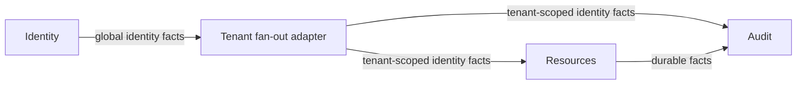

# Access Desk Architecture Requirements

## Status and authority

This document is the canonical architectural baseline for Access Desk. The PRD
remains product input but does not override this document where they conflict.

`references/event-storming.md` is the canonical current model snapshot — the
aggregates, process managers, and command→event transitions from the board. This
architecture and explicit user decisions govern where they differ; they do not
license rewriting the board.

**Must**, **must not**, and **required** mark architectural requirements. Exact
message names remain contract-design choices unless stated otherwise.

## Product posture

Access Desk is a demo-sized access request and approval application with
production-shaped architecture. It must be runnable as a demonstration, but its
domain boundaries, security, persistence, reliability, and tests must be
production-suitable foundations. Disposable shortcuts are acceptable only in
peripheral demo adapters, not in the domain or integration design.

The repository is independent of the Spine TS source repository and consumes
published npm artifacts from one exact compatible snapshot family. Runtime
baseline: Node.js 24 or newer, pnpm 11.9, strict TypeScript, and ESM.

## System shape

The system has three bounded contexts:

| Bounded context | Owns                                                                                                                                                                                                    | Tenant mode                        |
| --------------- | ------------------------------------------------------------------------------------------------------------------------------------------------------------------------------------------------------- | ---------------------------------- |
| Identity        | Global users, registration, authentication identity, user activity                                                                                                                                      | Global/single-tenant control plane |
| Resources       | Organizations, memberships, resources, ordered access levels, resource managers, request policy, requests, approval decisions, grants, extensions, revocation, and the durable scheduling those rely on | Organization-scoped                |
| Audit           | Immutable, redacted audit projections built from durable integration facts                                                                                                                              | Organization-scoped                |

Resources owns the whole request-and-approval domain. What earlier drafts split
into separate Access and Scheduling contexts — the request, approval, grant,
extension, and revocation lifecycles and the durable scheduling that serves them
— is now internal to Resources, not contexts of their own.

An initial deployment may co-host all three contexts in one Node.js application.
Co-location does not weaken the boundaries: each context must have its own model
package, generated module, `BoundedContext` instance, repositories, storage
layout, handlers, and ownership. Direct cross-context entity, repository, or
application-service calls are forbidden.

Cross-context state propagation and lifecycle choreography use versioned
external events. Commands are domestic to their receiving context. Sending a
due scheduled command is the explicit exception to event-based integration: the
Resources scheduling component posts it through the supplied same-server client,
and it re-enters its target through normal command ingress. Shared packages may contain
wire contracts and value types, but never another context's behavior or mutable
state. Each context owns its cross-context event contracts in its own model
package; a consumer depends on the publishing context's model for those schemas
and declares its external-event receptors internally.

## Tenant, identity, and authorization model

Organization is the tenant.

- `PersonId` is global and is not an email address.
- A user may have memberships in multiple organizations.
- Every tenant-scoped request, query, subscription, scheduled item, inbox row,
  outbox row, and audit record carries exactly one `OrganizationId` represented
  at the Spine boundary as the authoritative `TenantId`.
- The browser selects an organization explicitly. Switching organizations
  cancels tenant-scoped subscriptions, clears tenant-scoped client caches, and
  performs authoritative queries in the new organization.
- A trusted gateway resolves the opaque server-side session into the actor and
  active organization. Client command fields must not be trusted as actor or
  tenant authority.
- Resources and Audit are multitenant. Identity remains a global context and
  publishes global identity facts to durable integration infrastructure.
- Roles and permissions are organization-scoped. A role in one organization
  confers no authority in another.
- Storage namespaces and context-prefixed kinds provide defense in depth; they
  never replace handler, query, subscription, and gateway authorization.

Authentication must be behind an OIDC provider abstraction. Development uses a
local identity provider; production may bind a real provider without changing
domain code. Browser credentials are exchanged for opaque application sessions.
Provider tokens are not stored in browser application storage or passed into
bounded contexts.

### Roles, relations, and fine-grained authorization

Authority takes two forms, both organization-scoped.

A **role** is standing authority a person holds in the organization itself:
Organization Member (the baseline participant, who may act as a requester),
Auditor (read-only access to the audit timeline), and an organization
administration role that provisions the organization and its membership.

A **relation** is a position toward one specific entity, read from domain state
rather than granted as a role: the **manager** of a resource and the
**requester** of a request (`resource#manager`, `request#requester`).

A resource has one or more managers, named when it is created. Manager is a
relation, not an organization-wide role, and every manager of a resource holds
the same authority — no owner/administrator split, no approver priority.

Authorization is fine-grained and enforced as a domain invariant: only a current
manager of a resource may decide its access requests or revoke its grants,
checked per entity inside the `AccessRequest` and grant boundaries, not by a
separate authorization service or stored permission list. The trusted gateway
still performs coarse role- and tenant-level authorization of every command,
query, and subscription as defense in depth; it never replaces the domain
invariant, and a caller-supplied identifier is never authority.

### Global-to-tenant identity bridge

A single-tenant Spine event has no tenant and cannot be delivered directly to a
multitenant entity handler. Raw Identity events therefore never flow directly
into Resources or Audit.

The durable integration layer maintains a technical `PersonId` to
`OrganizationId` fan-out index from tenant-scoped Resources membership facts.
When Identity publishes a relevant global identity fact, the adapter emits one
derived, tenant-scoped integration fact for each known membership. Each
derivative has an ID based on the source integration ID and organization,
so retries are idempotent. Resources and Audit consume those facts where their
domain behavior requires them; membership has no separate activity lifecycle.

This adapter is an anti-corruption/routing component, not a sixth domain bounded
context. It owns no membership policy and cannot invent organizations. Missing
or stale fan-out state is repaired from durable Resources membership facts
before the affected identity change is considered fully delivered.

## Resources and policy ownership

Resources is authoritative for organizations, membership, resources, and
resource policy. A resource carries descriptive catalog attributes — its
identity, description, and category — that describe it for browsing but are not
access decision rules.

Names are display attributes, not identifiers. An organization has an
`OrganizationId` and a resource a system-generated `ResourceId` UUID; the
human-readable name is separate and may change. Organization names are unique
across organizations, and resource names are unique within their organization.
Both comparisons are case-insensitive, so "TeamDev" and "teamdev" denote the same
organization. Access levels are named per resource and are likewise unique and
case-insensitive within that resource.

Resource-name uniqueness is enforced by the Organization aggregate, which owns
the set of resource names and performs the authoritative, serialized check when
handling `Add Resource`. Because the `ResourceId` is a system-generated UUID, the
name is checked only at that recording step, not at the request. If recording is
rejected for a duplicate name, Resource Registration compensates by deleting the
created resource and reports `Resource Registration Failed`; the rejected
resource is never recorded. On success it reports `Resource Registered`. (See
`references/event-storming.md` for the full transition sequence.)

Its **policy** is the access decision rules the request-and-approval process
consumes, and includes:

- whether new requests are open;
- the data-sensitivity classification;
- one or more resource managers;
- ordered, resource-specific access levels;
- maximum permitted duration.

A resource's **managers** are its resource-scoped relation: any manager may decide
the resource's access requests, revoke and remediate its grants, and open or close
it for requests. All managers of a resource hold the same authority; there is no
owner/administrator split and no approver priority. The managers are set when the
resource is created and always number at least one. Authority is scoped to the
resource, never the organization; there is no organization-wide access
administrator.

Because requests, approvals, and policy live in one context, the
request-and-approval process reads `ResourceCatalogItem` directly rather than
mirroring policy from external facts. The request captures the policy facts it
needs at admission so a later decision does not depend on subsequent policy
changes.

Closing a resource prevents new requests. Requests already accepted while the
resource was open remain eligible for decision. The request captures the policy
facts necessary to explain and complete that decision.

Access levels are ordered only within their resource. The ordering supports
same-or-stronger access checks; it is not a universal permissions language.

## Request and approval invariants

A submitted request is immutable. Changing resource, level, justification, or
time requires canceling/closing the existing request and submitting a new one.

Submission must enforce all the following:

- The requester is a member of the tenant organization.
- The resource belongs to that organization and was open when the request was
  accepted.
- The requested level is offered by that resource.
- The justification is meaningful.
- The access period is canonical and positive: immediate durations and scheduled
  endpoints use whole-minute precision, and a scheduled interval has a strictly
  later exclusive end.
- The time specification is valid and within the maximum duration.
- The requester does not already hold same-or-stronger access for the relevant
  interval.
- No other nonterminal request by the same requester for the same resource has
  any overlapping requested interval, regardless of access level. Intervals are
  half-open, so `[a,b)` and `[b,c)` do not overlap.

Conflicting nonterminal requests use a duplicate-request rejection. Conflicts
with scheduled or active grants use the existing-access policy and a distinct
business rejection. Immediate requests retain a duration; overlap that can only
be known after an approval time is established must be revalidated before a
grant is created.

Any manager captured from the resource policy may decide a pending request; no
approver is assigned. Admission preserves policy order and removes duplicate
manager identifiers. A requester who is also a manager may decide their own
request. Approval or denial is terminal and happens at most once. Denial
requires a reason. Concurrent decisions are resolved by the aggregate
transaction so only one fact is accepted.

## Request and grant lifecycles

Requests and grants are separate aggregates and lifecycles. Approval records a
decision; it does not by itself prove that access is active or durably
scheduled.

Required request outcomes are pending, approved, denied, and canceled. Required
grant outcomes are pending scheduling, scheduled, active, expired, expired
without activation, and revoked. Contract design may use more precise internal
substates, but the UI must never claim scheduled or active access before the
required facts exist.

Scheduled and active grants may be revoked by any current manager of the granting
resource. Revocation authority is scoped to that resource, not the organization.
Revocation requires a reason. Revoked or expired grants never reactivate. The
grant lifecycle is authoritative: a stale due command after revocation or expiry
is an idempotent no-op.

An extension:

- is allowed only for an active grant;
- proposes an additional duration and changes no other grant field;
- requires a separate approval task and decision;
- is capped by the resource's maximum **total grant lifetime**, not an
  independent duration per extension;
- becomes ineffective if the grant expires or is revoked first.

When revocation or expiry makes a pending extension/confirmation task
irrelevant, remove that task from the pending-task projection. Immutable facts
remain in history. Removing a task already absent from the projection is an
idempotent no-op.

## Time semantics

Canonical timestamps are UTC and business precision is one minute. Every
interval is half-open `[start, end)`.

### Immediate access

An immediate request stores a duration rather than a chosen absolute end. If
approval is accepted at time `A`, its effective grant interval is
`[A, A + duration)`. The countdown begins at approval, not submission.

### Scheduled access

A scheduled request stores an explicit requested interval `[S,E)`. When
approval is accepted at `A`:

- `A < S`: create the grant pending scheduling; it becomes scheduled only after
  the scheduling component confirms persistence.
- `S <= A < E`: activation is due immediately and uses the same direct domestic
  activation command as an immediate request, not the scheduling component.
  Preserve requested `S` and `E` for history, but effective access begins at `A`
  and ends at `E`.
- `A >= E`: create the explicit expired-without-activation outcome. Never
  activate it.

Normal expiration and expiration without activation are distinct facts. If a
valid due activation command arrives once the clock is at or after the requested
end `E`, Resources records the expired-without-activation outcome exactly once
instead of activating. Duplicate, stale, revision-mismatched, canceled, revoked,
or otherwise terminal commands are successful no-ops. All time-based code uses an
injected clock; tests must not depend on arbitrary sleeping.

For maximum-total-lifetime checks after a delayed scheduled approval, use the
actual effective activation time through the proposed new end, while preserving
the originally requested interval for audit.

## Scheduling (internal Resources component)

Scheduling is an internal component of Resources, not a context of its own: a
single stateful `Scheduling` Process Manager that owns one planned command and
manages its scheduling lifecycle. Because it lives inside Resources, the grant
facts it reacts to and the scheduling facts it emits are domestic Resources
events rather than cross-context integration facts.

The process persists an allowlisted **application command value** in Protobuf
`Any` together with its schedule ID, authoritative organization, approved
purpose and target, due time, and current status. Type URLs must be registered,
explicitly allowlisted, tenant-compatible, target-compatible, size-bounded,
schema-compatible, and unpackable to the expected command value. The payload
never supplies a trusted tenant, actor, target route, or credentials.

The required choreography is:

1. Resources commits a genuine fact such as `AccessGrantCreated` with a
   pending-scheduling status and activation/expiration scheduling intents.
2. The `Scheduling` process reacts to that Resources fact and accepts the
   corresponding domestic `ScheduleCommand`.
3. The process persists the planned command and emits `CommandScheduled` only
   after that state is durable.
4. The grant lifecycle consumes the scheduling confirmation and establishes
   scheduled state only after every required schedule is confirmed. Active state
   additionally requires successful handling and the resulting fact from the
   target activation command.
5. When the due time passes, the same `Scheduling` process sends its stored
   command through the tenant-aware client supplied by the application. The
   client sends the command to the same server, and the target receives an
   ordinary domestic command.

The process accepts `ScheduleCommand`, `RescheduleCommand`, and
`CancelScheduledCommand`, and emits `CommandScheduled`, `CommandRescheduled`,
and `ScheduledCommandCanceled`. Extension approval is a genuine grant fact the
`Scheduling` process reacts to, rescheduling domestically and confirming it; the
grant applies the extension only after confirmation. Revocation is authoritative
in the grant lifecycle and emits a fact the `Scheduling` process reacts to,
canceling domestically.

The allowlist fixes the command schema and target route for each approved type
and purpose. The payload cannot select an endpoint, context, actor, or tenant.
Logs and Audit retain only the minimum redacted scheduling and correlation data,
never the stored command payload.

`ScheduleCommand`, `RescheduleCommand`, and `CancelScheduledCommand` are not
browser/public commands; they are admitted only from an authenticated, validated
committed integration receipt. Only due `Activate`/`Expire` receives a server-
minted capability after a current claim, bound to organization, schedule,
revision, purpose, route, and target type. Browser principals are denied
schedule/reschedule/cancel and direct activate/expire commands; the capability
is purpose-bound to the fixed route.

No item may be named or presented as scheduled before the `Scheduling` process
has persisted it. A suffix such as "requested" is unnecessary for the grant
facts that drive scheduling; they should describe the real grant state that
caused a scheduling intent.

## Audit

Audit consumes the same durable integration route as other required consumers.
It must be idempotent, immutable, organization-scoped, and rebuildable from
durable facts. It records actor, time, reason, related identifiers, correlation,
and causation while redacting secrets, credentials, and unnecessary payload
data. Audit ingestion must not synchronously block the originating business
command.

Audit projections and human-readable timelines are derived views, not editable
sources of truth. Retention/export policy remains a deployment decision and
must be documented before production use.

## Browser and read-side behavior

The intended browser stack is React with Vite, `@spine-event-engine/client-web`,
and `@spine-event-engine/client-react`.

- The browser connects through the authenticated application gateway, never a
  trusted private backend directly.
- Server-side authorization applies consistently to commands, queries, and
  subscriptions.
- Command acknowledgement does not imply that an asynchronous projection is
  already current.
- Entity subscriptions are hints. After connection loss, a detected gap, a
  tenant switch, malformed delivery, or an important command outcome, perform
  an authoritative query and replace stale client state.
- Required screens and flows remain accessible by keyboard, expose readable
  state/error text, and do not depend on color alone.

### Notifications and timeline

In-application notifications and timeline entries are derived read-side views —
pending manager decisions, request status, active-access changes, and the audit
timeline — over durable facts, surfaced through the same authenticated
subscriptions and authoritative re-query as every other screen. A subscription
is a best-effort hint; a missed notification is repaired by the next
authoritative query, never a guaranteed push. External channels such as email or
mobile push are outside the baseline; if added they must consume durable
integration facts and follow the same tenant, authorization, and redaction rules
as Audit.
