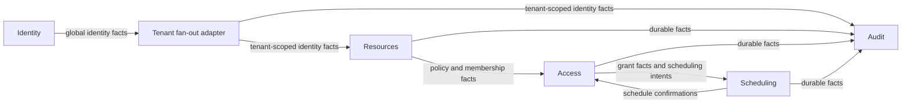

# Access Desk Architecture Requirements

## Status and authority

This document is the canonical architectural baseline for Access Desk. It
records the decisions accepted after the initial `PRD.md` draft and the current
Event Storming session. The PRD remains useful product input but is not changed
or silently treated as current when it conflicts with this document.

`references/event-storming.md` is the canonical current model snapshot: the
domain's aggregates, process managers, and their command→event transitions, read
from the current board. This architecture and explicit user decisions govern
where they differ from that model; they do not license rewriting what the board
shows. A replacement image replaces the current snapshot rather than creating
model history.

Normative words such as **must**, **must not**, and **required** identify
architectural requirements. Exact message names remain contract-design choices
unless this document says otherwise.

## Product posture

Access Desk is a demo-sized access request and approval application built with
production-shaped architecture. It must be understandable and runnable as a
demonstration, but its central domain boundaries, security, persistence,
reliability, and tests must be suitable foundations for a production system.
Disposable shortcuts are acceptable only in peripheral demo adapters, not in
the domain or integration design.

The repository is independent of the Spine TS source repository. It consumes
published npm artifacts from one exact compatible snapshot family. The initial
runtime baseline is Node.js 24 or newer, pnpm 11.9, strict TypeScript, and ESM.

## System shape

The system has five bounded contexts:

| Bounded context | Owns                                                                                                     | Tenant mode                        |
| --------------- | -------------------------------------------------------------------------------------------------------- | ---------------------------------- |
| Identity        | Global users, registration, authentication identity, user activity                                       | Global/single-tenant control plane |
| Resources       | Organizations, memberships, resources, ordered access levels, ownership, request policy, approver policy | Organization-scoped                |
| Access          | Requests, approval assignment and decisions, grants, extensions, revocation, access-facing projections   | Organization-scoped                |
| Scheduling      | Durable, universal dispatch of allowlisted application commands                                          | Organization-scoped                |
| Audit           | Immutable, redacted audit projections built from durable integration facts                               | Organization-scoped                |

An initial deployment may co-host all five contexts in one Node.js application.
Co-location does not weaken the boundaries: each context must have its own model
package, generated module, `BoundedContext` instance, repositories, storage
layout, handlers, and ownership. Direct cross-context entity, repository, or
application-service calls are forbidden.

Cross-context state propagation and lifecycle choreography use versioned
external events. Commands are domestic to their receiving context. Sending a
due command is the explicit exception to event-based integration: the
`Scheduling` process posts it through the supplied same-server client, and it
re-enters the target through normal command ingress. Shared packages may contain
wire contracts and value types, but never another context's behavior or mutable
state. Each context owns its cross-context event contracts in its own model
package; a consumer depends on the publishing context's model for those schemas
and declares its external-event receptors internally.

## Tenant, identity, and authorization model

Organization is the tenant.

- `PersonId` is globally stable and is not an email address.
- A user may have active memberships in multiple organizations.
- Every tenant-scoped request, query, subscription, scheduled item, inbox row,
  outbox row, and audit record carries exactly one `OrganizationId` represented
  at the Spine boundary as the authoritative `TenantId`.
- The browser selects an organization explicitly. Switching organizations
  cancels tenant-scoped subscriptions, clears tenant-scoped client caches, and
  performs authoritative queries in the new organization.
- A trusted gateway resolves the opaque server-side session into the actor and
  active organization. Client command fields must not be trusted as actor or
  tenant authority.
- Resources, Access, Scheduling, and Audit are multitenant. Identity remains a
  global context and publishes global identity facts to durable integration
  infrastructure.
- Roles and permissions are organization-scoped. A role in one organization
  confers no authority in another.
- Storage namespaces and context-prefixed kinds provide defense in depth; they
  never replace handler, query, subscription, and gateway authorization.

Authentication must be behind an OIDC provider abstraction. Development uses a
local identity provider; production may bind a real provider without changing
domain code. Browser credentials are exchanged for opaque application sessions.
Provider tokens are not stored in browser application storage or passed into
bounded contexts.

### Global-to-tenant identity bridge

A single-tenant Spine event has no tenant and cannot be delivered directly to a
multitenant entity handler. Raw Identity events therefore never flow directly
into Resources, Access, Scheduling, or Audit.

The durable integration layer maintains a technical `PersonId` to
`OrganizationId` fan-out index from tenant-scoped Resources membership facts.
When Identity publishes a relevant global activity/disablement fact, the
adapter emits one derived, tenant-scoped integration fact for each known active
membership. Each derivative has a stable ID based on the source integration ID
and organization, so retries are idempotent. Resources consumes that external
fact and issues a domestic command to update its authoritative membership;
Access consumes only the resulting tenant-scoped Resources membership facts.

This adapter is an anti-corruption/routing component, not a sixth domain bounded
context. It owns no membership policy and cannot invent organizations. Missing
or stale fan-out state is repaired from durable Resources membership facts
before the affected identity change is considered fully delivered.

## Resources and policy ownership

Resources is authoritative for organizations, membership, resources, and
resource policy. A resource policy includes:

- resource identity, description, category, and sensitivity;
- whether new requests are open;
- the resource owner;
- ordered, resource-specific access levels;
- maximum permitted duration;
- primary approver and fallback approver;
- a monotonically increasing policy version.

Resources publishes complete, versioned policy and membership facts. Access
maintains local monotonic projections and must not query Resources synchronously
while deciding a command. Stale or duplicate policy facts cannot roll a local
projection back.

Closing a resource prevents new requests. Requests already accepted while the
resource was open remain eligible for decision. The request captures the policy
facts necessary to explain and complete that decision; current membership and
actor activity are still rechecked for actions that require current authority.

Access levels are ordered only within their resource. The ordering supports
same-or-stronger access checks; it is not a universal permissions language.

## Request and approval invariants

A submitted request is immutable. Changing resource, level, justification, or
time requires cancelling/closing the existing request and submitting a new one.

Submission must enforce all the following:

- The requester is an active member of the tenant organization.
- The resource belongs to that organization and was open when the request was
  accepted.
- The requested level is offered by that resource.
- The justification is meaningful.
- The time specification is valid and within the maximum duration.
- The requester does not already hold same-or-stronger access for the relevant
  interval.
- No other nonterminal request by the same requester for the same resource has
  any overlapping requested interval, regardless of access level. Intervals are
  half-open, so `[a,b)` and `[b,c)` do not overlap.
- An eligible approver can be assigned before the request is accepted.

Conflicting nonterminal requests use a duplicate-request rejection. Conflicts
with scheduled or active grants use the existing-access policy and a distinct
business rejection. Immediate requests retain a duration; overlap that can only
be known after an approval time is established must be revalidated before a
grant is created.

Approver assignment follows this policy:

1. Use the primary approver only when their current organization membership is
   active and they are not the requester.
2. Otherwise use the active fallback approver when they are not the requester.
3. If neither is eligible at submission, reject the command; do not create an
   unserviceable request.
4. If the assigned primary becomes inactive before decision, reassign to the
   eligible fallback.
5. If no eligible approver remains after acceptance, close the request
   terminally with an explicit system reason.

Only the currently assigned, eligible approver may decide a pending request.
Self-approval is forbidden. Approval or denial is terminal and happens at most
once. Denial requires a reason. Concurrent decisions are resolved by the
aggregate transaction so only one fact is accepted.

## Request and grant lifecycles

Requests and grants are separate aggregates and lifecycles. Approval records a
decision; it does not by itself prove that access is active or durably
scheduled.

Required request outcomes are pending, approved, denied, cancelled, and a
terminal system closure when no approver remains. Required grant outcomes are
pending scheduling, scheduled, active, expired, expired without activation, and
revoked. Contract design may use more precise internal substates, but the UI
must never claim scheduled or active access before the required facts exist.

Scheduled and active grants may be revoked by either the resource owner or an
Access Administrator in the same organization. Revocation requires a reason.
Revoked or expired grants never reactivate. Access is authoritative: a stale
due command after revocation or expiry is an idempotent no-op.

An extension:

- is allowed only for an active grant;
- proposes a later end and changes no other grant field;
- requires a separate approval task and decision;
- is capped by the resource's maximum **total grant lifetime**, not an
  independent duration per extension;
- becomes ineffective if the grant expires or is revoked first.

When revocation or expiry makes a pending extension/confirmation task
irrelevant, remove that task from the pending-task projection. Immutable facts
remain in history. Removing a task already absent from the projection is an
idempotent no-op.

## Time semantics

Canonical timestamps are UTC and business precision is one minute. Every
interval is half-open `[start, end)`.

### Immediate access

An immediate request stores a duration rather than a chosen absolute end. If
approval is accepted at time `A`, its effective grant interval is
`[A, A + duration)`. The countdown begins at approval, not submission.

### Scheduled access

A scheduled request stores an explicit requested interval `[S,E)`. When
approval is accepted at `A`:

- `A < S`: create the grant pending scheduling; it becomes scheduled only after
  Scheduling confirms persistence.
- `S <= A < E`: activation is due immediately and uses the same direct domestic
  activation command as an immediate request, not the Scheduling context.
  Preserve requested `S` and `E` for history, but effective access begins at `A`
  and ends at `E`.
- `A >= E`: create the explicit expired-without-activation outcome. Never
  activate it.

Normal expiration and expiration without activation are distinct facts. When a
due activation command is current and tenant-valid, with matching schedule ID,
schedule revision, and dispatch ID, and its grant is still eligible, but the
injected clock is now at or after the requested end `E`, Access atomically
records the existing expired-without-activation terminal outcome exactly once.
It neither activates the grant nor creates activation or expiration scheduling
work. Duplicate commands after that terminal outcome, and stale, revision-mismatched,
cancelled, revoked, or otherwise terminal commands, are successful no-ops.
All time-based code uses an injected clock; tests must not depend on arbitrary
sleeping.

For maximum-total-lifetime checks after a delayed scheduled approval, use the
actual effective activation time through the proposed new end, while preserving
the originally requested interval for audit.

## Scheduling bounded context

Scheduling is a separate multitenant bounded context with a single stateful
`Scheduling` Process Manager that owns one planned command and manages its
scheduling lifecycle.

The process persists an allowlisted **application command value** in Protobuf
`Any` together with its schedule ID, authoritative organization, approved
purpose and target, due time, and current status. Type URLs must be registered,
explicitly allowlisted, tenant-compatible, target-compatible, size-bounded,
schema-compatible, and unpackable to the expected command value. The payload
never supplies a trusted tenant, actor, target route, or credentials.

The required choreography is:

1. Access commits a genuine fact such as `AccessGrantCreated` with a
   pending-scheduling status and activation/expiration scheduling intents.
2. The `Scheduling` process consumes that external Access fact and accepts the
   corresponding domestic `ScheduleCommand`.
3. The process persists the planned command and emits `CommandScheduled` only
   after that state is durable.
4. Access consumes the scheduling confirmation and establishes scheduled state
   only after every required schedule is confirmed. Active state additionally
   requires successful handling and the resulting fact from the target
   activation command.
5. When the due time passes, the same `Scheduling` process sends its stored
   command through the tenant-aware client supplied by the application. The
   client sends the command to the same server, and the target receives an
   ordinary domestic command.

The process accepts `ScheduleCommand`, `RescheduleCommand`, and
`CancelScheduledCommand`, and emits `CommandScheduled`, `CommandRescheduled`,
and `ScheduledCommandCancelled`. Extension approval is a genuine Access fact
consumed by Scheduling, which reschedules domestically and confirms it; Access
applies the extension only after confirmation. Revocation is authoritative in
Access and emits a fact that Scheduling consumes to cancel domestically.

The allowlist fixes the command schema and target route for each approved type
and purpose. The payload cannot select an endpoint, context, actor, or tenant.
Logs and Audit retain only the minimum redacted scheduling and correlation data,
never the stored command payload.

`ScheduleCommand`, `RescheduleCommand`, and `CancelScheduledCommand` are not
browser/public commands; they are admitted only from an authenticated, validated
committed integration receipt. Only due `Activate`/`Expire` receives a server-
minted capability after a current claim, bound to organization, schedule,
revision, purpose, route, and target type. Browser principals are denied
schedule/reschedule/cancel and direct activate/expire commands; the capability
is purpose-bound to the fixed route.

No item may be named or presented as scheduled before the `Scheduling` process
has persisted it. A suffix such as "requested" is unnecessary for Access facts;
they should describe the real Access state that caused a scheduling intent.

## Audit

Audit consumes the same durable integration route as other required consumers.
It must be idempotent, immutable, organization-scoped, and rebuildable from
durable facts. It records actor, time, reason, related identifiers, correlation,
and causation while redacting secrets, credentials, and unnecessary payload
data. Audit ingestion must not synchronously block the originating business
command.

Audit projections and human-readable timelines are derived views, not editable
sources of truth. Retention/export policy remains a deployment decision and
must be documented before production use.

## Browser and read-side behavior

The intended browser stack is React with Vite, `@spine-event-engine/client-web`,
and `@spine-event-engine/client-react`.

- The browser connects through the authenticated application gateway, never a
  trusted private backend directly.
- Server-side authorization applies consistently to commands, queries, and
  subscriptions.
- Command acknowledgement does not imply that an asynchronous projection is
  already current.
- Entity subscriptions are hints. After connection loss, a detected gap, a
  tenant switch, malformed delivery, or an important command outcome, perform
  an authoritative query and replace stale client state.
- Required screens and flows remain accessible by keyboard, expose readable
  state/error text, and do not depend on color alone.

### Notifications and timeline

The in-application notifications and timeline entries are derived read-side views.
Pending approver work, requester request status, active-access changes, and the audit
timeline are Projections over durable facts, surfaced through the same
authenticated subscriptions and authoritative re-query as every other screen. A
subscription is a best-effort hint; a missed notification is repaired by the
next authoritative query, never assumed delivered by a guaranteed push. External
channels such as email or mobile push are outside the accepted baseline; if
added later they must consume durable integration facts and follow the same
tenant, authorization, and redaction rules as Audit.
