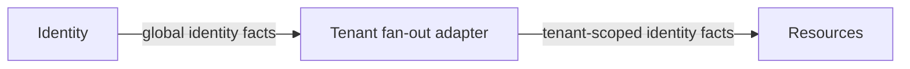

# Access Desk Architecture Requirements

## Status and authority

This document is the canonical architectural baseline for Access Desk. The PRD
remains product input but does not override this document where they conflict.

`references/event-storming.md` is the canonical current model snapshot — the
aggregates, process managers, and command→event transitions from the board. This
architecture and explicit user decisions govern where they differ; they do not
license rewriting the board.

**Must**, **must not**, and **required** mark architectural requirements. Exact
message names remain contract-design choices unless stated otherwise.

## Product posture

Access Desk is a demo-sized access request and approval application with
production-shaped architecture. It must be runnable as a demonstration, but its
domain boundaries, security, persistence, reliability, and tests must be
production-suitable foundations. Disposable shortcuts are acceptable only in
peripheral demo adapters, not in the domain or integration design.

The repository is independent of the Spine TS source repository and consumes
published npm artifacts from one exact compatible snapshot family. Runtime
baseline: Node.js 24 or newer, pnpm 11.9, strict TypeScript, and ESM.

## System shape

The system has two bounded contexts:

| Bounded context | Owns                                                                                                                                                                                 | Tenant mode                        |
| --------------- | ------------------------------------------------------------------------------------------------------------------------------------------------------------------------------------ | ---------------------------------- |
| Identity        | Global users, registration, authentication identity, user activity                                                                                                                   | Global/single-tenant control plane |
| Resources       | Organizations, memberships, resources, ordered access levels, resource managers, request policy, requests, approval decisions, grants, extensions, revocation, and audit projections | Organization-scoped                |

An initial deployment may co-host both contexts in one Node.js application.
Co-location does not weaken the boundaries: each context must have its own model
package, generated module, `BoundedContext` instance, repositories, storage
layout, handlers, and ownership. Direct cross-context entity, repository, or
application-service calls are forbidden.

```mermaid
flowchart LR
  Identity -->|global identity facts| Fanout[Tenant fan-out adapter]
  Fanout -->|tenant-scoped identity facts| Resources
```

Cross-context state propagation and lifecycle choreography use versioned
external events. Commands are domestic to their receiving context. Shared
packages may contain wire contracts and value types, but never another
context's behavior or mutable state. Each context owns its cross-context
event contracts in its own model package; a consumer depends on the
publishing context's model for those schemas and declares its
external-event receptors internally.

## Tenant, identity, and authorization model

Organization is the tenant.

- `PersonId` is global and is not an email address.
- A user may have memberships in multiple organizations.
- Every tenant-scoped request, query, subscription, inbox row,
  outbox row, and audit record carries exactly one `OrganizationId` represented
  at the Spine boundary as the authoritative `TenantId`.
- The browser selects an organization explicitly. Switching organizations
  cancels tenant-scoped subscriptions, clears tenant-scoped client caches, and
  performs authoritative queries in the new organization.
- A trusted gateway resolves the opaque server-side session into the actor and
  active organization. Client command fields must not be trusted as actor or
  tenant authority.
- Resources is multitenant. Identity remains a global context and publishes
  global identity facts to durable integration infrastructure.
- Roles and permissions are organization-scoped. A role in one organization
  gives no authority in another.
- Storage namespaces and context-prefixed kinds provide defense in depth; they
  never replace handler, query, subscription, and gateway authorization.

Authentication must be behind an OIDC provider abstraction. Development uses a
local identity provider; production may bind a real provider without changing
domain code. Browser credentials are exchanged for opaque application sessions.
Provider tokens are not stored in browser application storage or passed into
bounded contexts.

### Roles, relations, and fine-grained authorization

Authority takes two forms, both organization-scoped.

A **role** is standing authority a person holds in the organization itself:
Organization Member (the baseline participant, who may act as a requester),
Auditor (read-only access to the audit timeline), and an organization
administration role that provisions the organization and its membership.

A **relation** is a position toward one specific entity, read from domain state
rather than granted as a role: the **manager** of a resource and the
**requester** of a request (`resource#manager`, `request#requester`).

A resource has one or more managers, named when it is created. Manager is a
relation, not an organization-wide role, and every manager of a resource holds
the same authority — no owner/administrator split, no approver priority.

Authorization is fine-grained and enforced as a domain invariant: only a current
manager of a resource may decide its access requests or revoke its grants,
checked per entity inside the `AccessRequest` and grant boundaries, not by a
separate authorization service or stored permission list. The trusted gateway
still performs coarse role- and tenant-level authorization of every command,
query, and subscription as defense in depth; it never replaces the domain
invariant, and a caller-supplied identifier is never authority.

### Global-to-tenant identity bridge

A single-tenant Spine event has no tenant and cannot be delivered directly to a
multitenant entity handler. Raw Identity events therefore never flow directly
into Resources.

The durable integration layer maintains a technical `PersonId` to
`OrganizationId` fan-out index from tenant-scoped Resources membership facts.
When Identity publishes a relevant global identity fact, the adapter emits one
derived, tenant-scoped integration fact for each known membership. Each
derivative has an ID based on the source integration ID and organization,
so retries are idempotent. Resources consumes those facts where its domain
behavior requires them; membership has no separate activity lifecycle.

This adapter is an anti-corruption/routing component, not a domain bounded
context. It owns no membership policy and cannot invent organizations. Missing
or stale fan-out state is repaired from durable Resources membership facts
before the affected identity change is considered fully delivered.

## Resources and policy ownership

Resources is authoritative for organizations, membership, resources, and
resource policy. A resource carries descriptive catalog attributes — its
identity, description, and category — that describe it for browsing but are not
access decision rules.

Names are display attributes, not identifiers. An organization has an
`OrganizationId` and a resource a system-generated `ResourceId` UUID; the
human-readable name is separate and may change. Organization names are unique
across organizations, and resource names are unique within their organization.
Both comparisons are case-insensitive, so "TeamDev" and "teamdev" denote the same
organization. Access levels are named per resource and are likewise unique and
case-insensitive within that resource.

Resource-name uniqueness is enforced by the Organization aggregate, which owns
the set of resource names and performs the authoritative, serialized check when
handling `Add Resource`. Because the `ResourceId` is a system-generated UUID, the
name is checked only at that recording step, not at the request. If recording is
rejected for a duplicate name, Resource Registration compensates by deleting the
created resource and reports `Resource Registration Failed`; the rejected
resource is never recorded. On success it reports `Resource Registered`. (See
`references/event-storming.md` for the full transition sequence.)

Its **policy** is the access decision rules the request-and-approval process
consumes, and includes:

- whether new requests are open;
- the data-sensitivity classification;
- one or more resource managers;
- ordered, resource-specific access levels;
- maximum permitted duration.

A resource's **managers** are its resource-scoped relation: any manager may decide
the resource's access requests, revoke and remediate its grants, and open or close
it for requests. All managers of a resource hold the same authority; there is no
owner/administrator split and no approver priority. The managers are set when the
resource is created and always number at least one. Authority is scoped to the
resource, never the organization; there is no organization-wide access
administrator.

Because requests, approvals, and policy live in one context, the
request-and-approval process reads `ResourceCatalogItem` directly rather than
mirroring policy from external facts. The request captures the policy facts it
needs at admission so a later decision does not depend on subsequent policy
changes.

Closing a resource prevents new requests. Requests already accepted while the
resource was open remain eligible for decision. The request captures the policy
facts necessary to explain and complete that decision.

Access levels are ordered only within their resource. The ordering supports
same-or-stronger access checks; it is not a universal permissions language.

## Request and approval invariants

A submitted request is immutable. Changing resource, level, justification, or
time requires canceling/closing the existing request and submitting a new one.

Submission must enforce all the following:

- The requester is a member of the tenant organization.
- The resource belongs to that organization and was open when the request was
  accepted.
- The requested level is offered by that resource.
- The justification is meaningful.
- The time specification is valid — the access ends after it begins — and
  within the maximum duration.
- The requester does not already hold same-or-stronger access for the relevant
  interval.
- No other nonterminal request by the same requester for the same resource has
  any overlapping requested interval, regardless of access level. Intervals are
  half-open, so `[a,b)` and `[b,c)` do not overlap.

Conflicting nonterminal requests use a duplicate-request rejection. Conflicts
with grants that are not revoked, whether their period has begun or not, use the
existing-access policy and a distinct business rejection. Access already held
is checked when a request is submitted, not again when it is approved.

Any manager captured from the resource policy may decide a pending request; no
approver is assigned. Admission preserves policy order and removes duplicate
manager identifiers. A requester who is also a manager may decide their own
request. Approval or denial is terminal and happens at most once. Denial
requires a reason. Concurrent decisions on one request are handled one at a
time, so only the first is accepted and the others are rejected with
`RequestAlreadyDecided`.

## Request and grant lifecycles

Requests and grants are separate lifecycles. The request is a process. The
grants one person holds to one resource form one aggregate, Resource Access,
which reads nothing but its own state.

A submission is checked before the request is accepted, and changes no grant:

1. The requester submits a request, which is checked against the resource's
   policy from the catalog.
2. The requester's access to the resource checks what the request asks for:
   the requested access, or the requested extension of a grant. Both checks
   bring the longest total access the resource permits.
3. When the check rejects — access already held, too long, or a grant that
   gives no access — the submission fails and the request ends without effect.
   Otherwise the request is submitted and awaits a manager's decision.

A first-time request and an extension request tell the start and the failure
of their submission with their own facts.

Grants change only after approval.

A manager's approval takes effect on the grant before the request counts as
approved:

1. The manager approves a pending request.
2. A first-time request asks for its grant to be created, and an extension
   request asks for the grant it names to be extended.
3. Once the grant is created or extended, the request is approved.
4. When the grant to extend gives no access (`AccessGrantNotActive`), the
   approval fails and the request ends without effect.

While the grant is asked, the request accepts no other decision.

Request statuses are submission started, submission failed, pending,
approval started, approved, approval failed, denied, and canceled.

Any manager of the granting resource may revoke it, with a reason, until its
end, whether its period has begun or not. The managers are those of the
approved request, which the person's access to the resource keeps. That access
keeps only what it decides by: each grant's level and period, and those
managers. A grant that ended or was revoked is forgotten there. The grant's
read model shows the request that issued it and each extension request that
moved its end, so who approved the access is read from those requests.
Revocation authority is scoped to that resource, not the organization.

An extension:

- submission requires a grant that gives access now;
- adds a positive duration to the grant's end, proposing the later end it
  would have, and changes no other grant field;
- requires a separate approval task and decision;
- is capped by the resource's maximum **total grant lifetime**, not an
  independent duration per extension, checked when the extension is submitted.

When a grant is revoked, its pending extension tasks leave the pending-task
projection. The projection also retains the revoked grant identifier so a
late-arriving extension submission cannot recreate its task. Immutable facts
remain in history.

## Time semantics

Canonical timestamps are UTC and business precision is one minute. Every
interval is half-open `[start, end)`.

### Immediate access

An immediate request stores a duration rather than a chosen absolute end. If
approval is accepted at time `A`, its effective grant interval is
`[A, A + duration)`. The countdown begins at approval, not submission.

### Scheduled access

A scheduled request stores an explicit requested interval `[S,E)`. When
approval is accepted at `A`:

- `A < S`: the grant keeps `[S, E)`, and gives access from `S`.
- `S <= A < E`: the grant covers `[A, E)` and gives access at once. The
  requested `S` and `E` are kept on the request for history.
- `A >= E`: the grant keeps `[S, E)`, which has already ended, so it never
  gives access.

All time-based code uses an injected clock; tests must not depend on arbitrary
sleeping.

For maximum-total-lifetime checks after a delayed scheduled approval, use the
grant's effective start through the proposed new end, while preserving the
originally requested interval for audit.

## Audit (internal Resources component)

Audit is an internal component of Resources, not a context of its own: audit
projections built from Resources' durable facts. They must be idempotent,
immutable, organization-scoped, and rebuildable from durable facts, recording
actor, time, reason, related identifiers, correlation, and causation while
redacting secrets, credentials, and unnecessary payload data. Audit ingestion
must not synchronously block the originating business command.

Audit projections and human-readable timelines are derived views, not editable
sources of truth. Retention/export policy remains a deployment decision and
must be documented before production use.

## Browser and read-side behavior

The intended browser stack is React with Vite, `@spine-event-engine/client-web`,
and `@spine-event-engine/client-react`.

- The browser connects through the authenticated application gateway, never a
  trusted private backend directly.
- Server-side authorization applies consistently to commands, queries, and
  subscriptions.
- Command acknowledgement does not imply that an asynchronous projection is
  already current.
- Entity subscriptions are hints. After connection loss, a detected gap, a
  tenant switch, malformed delivery, or an important command outcome, perform
  an authoritative query and replace stale client state.
- Required screens and flows remain accessible by keyboard, expose readable
  state/error text, and do not depend on color alone.

### Notifications and timeline

In-application notifications and timeline entries are derived read-side views —
pending manager decisions, request status, active-access changes, and the audit
timeline — over durable facts, surfaced through the same authenticated
subscriptions and authoritative re-query as every other screen. A subscription
is a best-effort hint; a missed notification is repaired by the next
authoritative query, never a guaranteed push. External channels such as email or
mobile push are outside the baseline; if added they must consume durable
integration facts and follow the same tenant, authorization, and redaction rules
as Audit.
