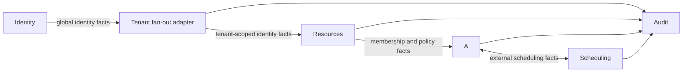

# Current Event Storming Model

## Purpose

This file is the current textual interpretation of the Access Desk Event
Storming model. It is replaced in place when the user supplies an updated
model.

## Interpreted legend

The current board appears to use:

- yellow headers for Aggregates;
- purple headers for Process Managers;
- blue notes for commands;
- orange notes for domain events;
- red notes for business rejections;
- green notes for projection consequences;
- small pale notes for actors or external triggers.

Color alone is not authoritative. Message tense, sequence, connectors, and
surrounding labels must confirm the role of a note.

## Bounded-context map

The board defines five bounded contexts:

## Identity

### Domain responsibility

Identity owns global user registration and authentication identity. Users do
not belong to exactly one organization; organization membership is owned by
Resources and refers to the global `UserId`.

## Resources

### Aggregates and entities

- `Organization` (Singleton) owns organization identity and the membership boundary.
- `Resource` owns its catalogue information and request policy.

### Commands and facts

- Create an organization -> organization created.
- Manage organization membership -> member added, changed, disabled, or removed.
- Create a resource -> resource created; duplicate identity is rejected.
- Assign or change resource owner.
- Assign primary and fallback approvers.
- Open a resource for requests -> resource opened.
- Close a resource for requests -> resource closed.
- Define ordered access levels and maximum total duration.

Resources publishes complete versioned membership and resource-policy facts.
Access consumes them into local projections. Closing a resource affects new
submissions but does not invalidate already accepted pending requests.

## Access

Access contains the principal business flow and several distinct consistency
boundaries.

### Access Request aggregate

Commands include submitting, cancelling, approving, and denying an access
request. Facts include request submitted, cancelled, approved, denied, assigned,
reassigned, and system-closed. Rejections cover invalid policy, duration,
membership, overlap, unavailable approver, unauthorized decision,
self-approval, and already-terminal state.

Requests are immutable. One request is one proposal for one requester,
resource, level, justification, and time intent.

### Approval Assignment process

The assignment process selects an active primary approver unless self-approval
or inactivity requires the fallback. It reacts to relevant membership/activity
facts and reassigns an undecided request when possible. If no eligible approver
exists at submission, submission is rejected; if none remains later, the
accepted request closes with a system reason.

The approval inbox is a projection of pending assigned work, not an independent
editable task store.

### Grant Issuance process

Approval causes Access to create a grant in a truthful pending-scheduling state.
It emits a fact carrying the activation and expiration scheduling intents; it
does not claim that those events are already scheduled.

Scheduling confirmations move the Access model into scheduled or active state.
If the scheduled interval is already partially elapsed at approval, activation
is due immediately and effective access starts at approval. If its end has
already elapsed, the grant records expiration without activation.

### Access Grant aggregate

Commands include activating, expiring, and revoking a grant and applying a
confirmed extension. Facts distinguish grant creation, scheduling confirmation,
activation, normal expiration, expiration without activation, revocation, and
extension. Scheduled and active grants are revocable by the resource owner or
Access Administrator. Stale scheduler releases cannot change terminal state.

### Extension and expiration processes

An active grant may receive an extension request for a later end. A separate
approval decision authorizes it. Scheduling confirms the reschedule before the
new end is treated as durable. Expiration or revocation removes any obsolete
pending task from the pending-task projection while retaining history.

## Scheduling

### Scheduled Event aggregate

Scheduling is a universal external bounded context. It stores an allowlisted
event payload in Protobuf `Any` together with tenant, target, due time, revision,
stable integration identity, status, lease, and attempt data.

Domestic commands include:

- `ScheduleEvent`
- `RescheduleEvent`
- `CancelScheduledEvent`
- `ClaimDueEvent` or `ReleaseScheduledEvent`

Domain facts include:

- `EventScheduled`
- `EventRescheduled`
- `ScheduledEventCancelled`
- `ScheduledEventReleased`
- explicit failure/quarantine facts where required by the final contract

Only `EventScheduled` after aggregate persistence allows another context to say
that an event is scheduled. A worker uses a due projection and compare-and-set
lease; it never edits another context's grant directly.

## Audit

Audit subscribes to required durable external facts from every context. It
deduplicates by integration identity and builds immutable, organization-scoped,
redacted projections for timelines and search. Audit does not synchronously
gate originating commands, and its projections are not a second source of
editable history.

## Replacement procedure

For a future model image:

1. Inspect the image at the highest available resolution.
2. Infer the legend from repeated shapes, colors, tense, and connections.
3. Extract bounded contexts, actors, commands, events, aggregates, policies,
   Process Managers, projections, rejections, and hotspots.
4. Mark genuinely unreadable or uncertain items; do not fabricate sticky-note
   text.
5. Reconcile the new model with explicit user text and the non-domain platform
   requirements in `references/architecture.md`.
6. Replace this file with the new current interpretation. Remove any previously
   stored source screenshot instead of archiving it.
7. If implementation was requested, update affected canonical requirements and
   then implement the model through contracts, code, data/index changes, UI,
   migration/rebuild steps, and tests.
